# Arquitectura de Integración — Mercado Pago
> Staff Architect Design · Branch: `feature/mercadopago` · Target: v1.004.00 · 2026-06-20  
> Basado en: `docs/mercadopago-analysis.md` y `docs/system-map.md`

---

## Índice

1. [Visión General](#1-visión-general)
2. [Modelo de Persistencia](#2-modelo-de-persistencia)
3. [Cifrado AES-256-GCM](#3-cifrado-aes-256-gcm)
4. [Máquina de Estados del Ticket](#4-máquina-de-estados-del-ticket)
5. [OAuth Flow — Conexión de Cuenta MP](#5-oauth-flow--conexión-de-cuenta-mp)
6. [Payments — Creación de Preferencias y Consulta](#6-payments--creación-de-preferencias-y-consulta)
7. [Circuit Breaker — Resiliencia contra fallos de MP](#7-circuit-breaker--resiliencia-contra-fallos-de-mp)
8. [Webhooks — Idempotencia y Procesamiento Seguro](#8-webhooks--idempotencia-y-procesamiento-seguro)
9. [Observabilidad — Logging, Métricas y Correlation-ID](#9-observabilidad--logging-métricas-y-correlation-id)
10. [Arquitectura de Packages](#10-arquitectura-de-packages)
11. [Firmas de Métodos y Excepciones](#11-firmas-de-métodos-y-excepciones)
12. [Diagrama de Componentes Completo](#12-diagrama-de-componentes-completo)
13. [Matriz de Decisiones](#13-matriz-de-decisiones)

---

## 1. Visión General

### Modelo de integración adoptado

Cada vendedor conecta su **propia cuenta de Mercado Pago** vía OAuth 2.0. Los pagos van directo a la cuenta del vendedor. La plataforma no intermedia el dinero (sin Marketplace). Esto simplifica la integración y la responsabilidad fiscal.

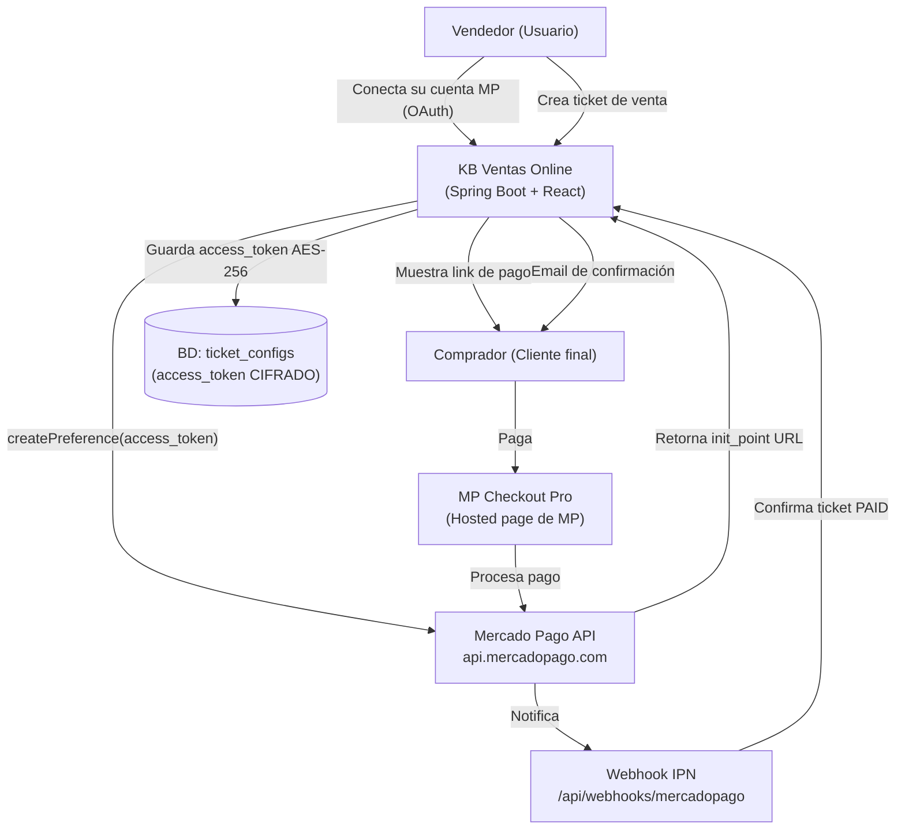

### Capas de la integración

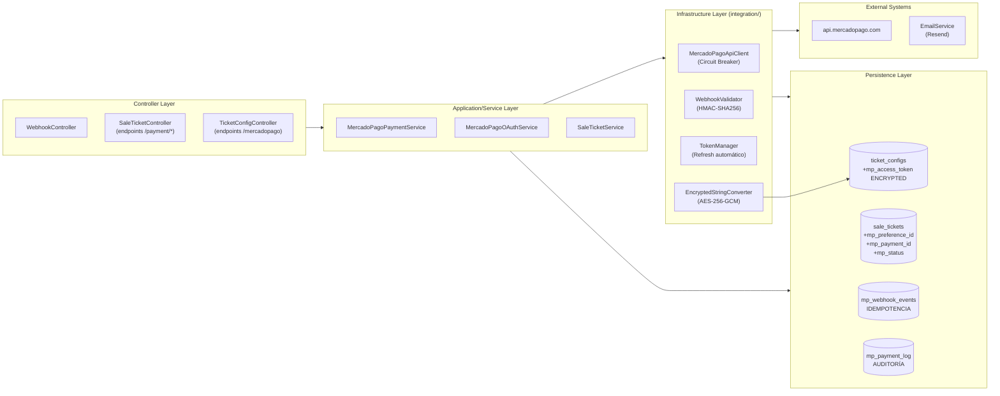

---

## 2. Modelo de Persistencia

### 2.1 Extensión de `TicketConfig` — Credenciales MP por Tenant

Todos los campos sensibles usan `@Convert(converter = EncryptedStringConverter.class)`. Los campos no sensibles van en plain text.

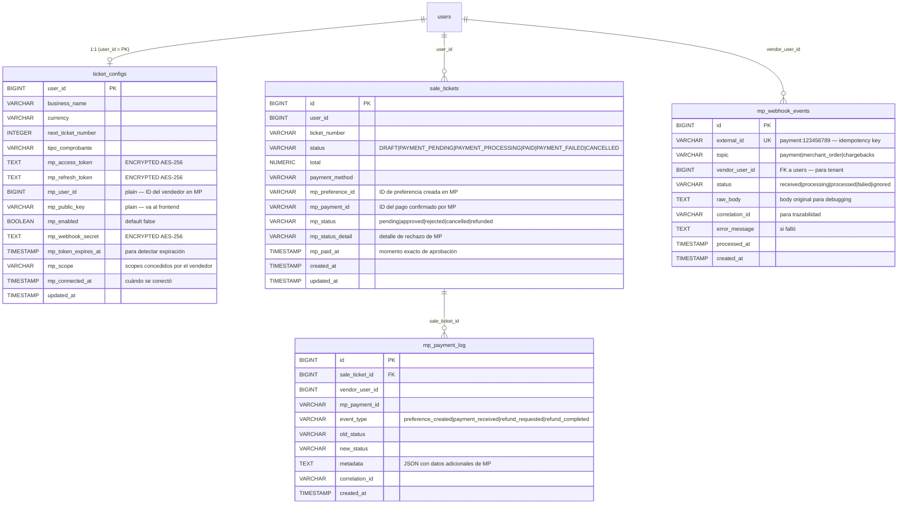

### 2.2 Justificación del modelo de tablas

| Tabla | Por qué existe | Alternativa descartada |
|-------|---------------|----------------------|
| `ticket_configs` extendida | Ya es 1:1 con User; tenant isolation resuelto | Nueva tabla `mp_credentials`: duplica la clave de tenant |
| `mp_webhook_events` | Log de idempotencia separado del negocio | Campo `processed` en `sale_tickets`: no registra intentos fallidos ni topics distintos de `payment` |
| `mp_payment_log` | Auditoría de cada transición de estado de pago | Usar `email_logs` existente: propósito distinto, no relaciona con ticket_id |

### 2.3 Índices críticos

```sql
-- Para idempotencia (lookup por external_id en webhook)
CREATE UNIQUE INDEX uq_mp_webhook_external ON mp_webhook_events(external_id);

-- Para consultar estado de pago de un ticket
CREATE INDEX idx_sale_tickets_mp_payment_id ON sale_tickets(mp_payment_id)
  WHERE mp_payment_id IS NOT NULL;

-- Para correlacionar logs por vendedor
CREATE INDEX idx_mp_payment_log_vendor ON mp_payment_log(vendor_user_id, created_at DESC);

-- Para limpiar eventos viejos
CREATE INDEX idx_mp_webhook_created ON mp_webhook_events(created_at);
```

---

## 3. Cifrado AES-256-GCM

### 3.1 Por qué AES-256-GCM sobre otras opciones

| Algoritmo | Confidencialidad | Integridad | Autenticación | Nonce requerido | Elección |
|-----------|-----------------|------------|--------------|----------------|---------|
| AES-256-CBC | ✅ | ❌ | ❌ | IV fijo posible | ❌ |
| AES-256-GCM | ✅ | ✅ | ✅ (tag) | IV aleatorio | **✅ Elegido** |
| RSA-2048 | ✅ | ❌ | ❌ | N/A | ❌ (lento, no para volumen) |
| BCrypt | ✅ (hash) | N/A | N/A | — | ❌ (no reversible) |

GCM proporciona **autenticación del cifrado** (AEAD): si el ciphertext es alterado en BD, la desencriptación falla con excepción en lugar de retornar datos corruptos silenciosamente.

### 3.2 Formato del valor cifrado en BD

```
Formato stored en columna TEXT:
  Base64Url( IV(12 bytes) || Ciphertext || AuthTag(16 bytes) )

Ejemplo:
  "dGVzdC1pdg==.dGVzdC1jaXBoZXJ0ZXh0.dGVzdC1hdXRodGFn"
  └── IV ──────┘└──── Ciphertext ───┘└──── Auth Tag ────┘

Separador: punto (para distinguir partes sin ambigüedad)
```

### 3.3 Gestión de la clave de cifrado

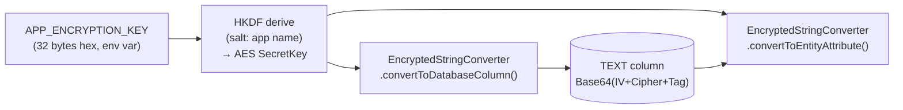

**Regla de la clave:**
- Generada una vez: `openssl rand -hex 32`
- Guardada SOLO como env var en Render (no en código, no en `.properties`, no en git)
- Si se rota: migración de re-encriptación en lote (script fuera de ddl-auto)
- En desarrollo local: `.env` local ignorado por git

### 3.4 Firma de la clase `EncryptedStringConverter`

```java
// package: com.jafpsoft.ventas.security.crypto
@Component
public class EncryptedStringConverter implements AttributeConverter<String, String> {

    // Llamado por JPA antes de escribir en BD
    @Override
    public String convertToDatabaseColumn(String plaintext);

    // Llamado por JPA después de leer de BD
    @Override
    public String convertToEntityAttribute(String ciphertext);

    // Verifica que la clave está correctamente configurada al iniciar
    @PostConstruct
    public void validateKey();
}
```

**Excepciones:**
- `CryptoConfigurationException extends RuntimeException` — `APP_ENCRYPTION_KEY` ausente o inválida al startup
- `CryptoOperationException extends RuntimeException` — falla de encrypt/decrypt (tag inválido = tampering detectado)

---

## 4. Máquina de Estados del Ticket

### 4.1 Diagrama de estados

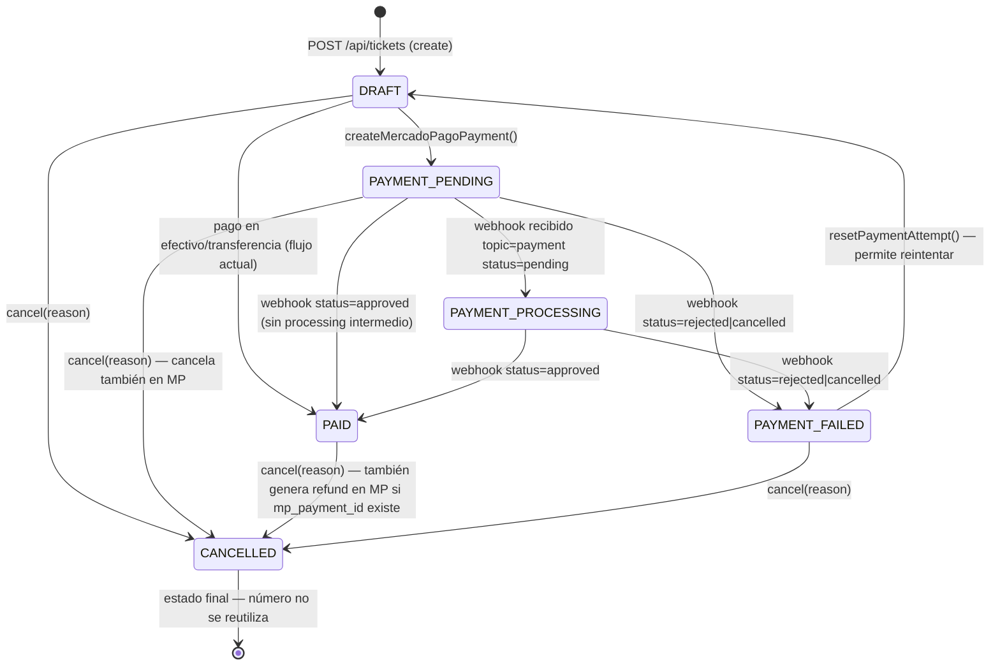

### 4.2 Enum `TicketStatus`

```java
// package: com.jafpsoft.ventas.model.enums
public enum TicketStatus {
    DRAFT,
    PAYMENT_PENDING,
    PAYMENT_PROCESSING,
    PAID,
    PAYMENT_FAILED,
    CANCELLED;

    // Retorna true si la transición current → next es válida
    public boolean canTransitionTo(TicketStatus next);

    // Verdadero si el ticket está en un estado terminal
    public boolean isTerminal();

    // Verdadero si hay un pago de MP en vuelo
    public boolean hasMercadoPagoPaymentInFlight();
}
```

**Excepción:**
- `IllegalTicketStateTransitionException(TicketStatus from, TicketStatus to)` — se lanza desde `SaleTicketService` antes de cualquier `setStatus()`

### 4.3 Impacto del stock por estado

| Transición | Ajuste de stock | Quién lo dispara |
|-----------|----------------|-----------------|
| `DRAFT → PAID` (efectivo) | `delta = -1` | `SaleTicketService.updateStatus()` |
| `DRAFT → PAYMENT_PENDING` | `delta = 0` (reserva lógica, no física aún) | `MercadoPagoPaymentService.createPreference()` |
| `PAYMENT_PENDING → PAID` (webhook) | `delta = -1` | `MercadoPagoWebhookProcessor.onPaymentApproved()` |
| `PAYMENT_FAILED → DRAFT` | `delta = 0` | `SaleTicketService.resetPaymentAttempt()` |
| `PAID → CANCELLED` | `delta = +1` | `SaleTicketService.cancel()` |
| `PAYMENT_PENDING → CANCELLED` | `delta = 0` | `SaleTicketService.cancel()` |

> Nota: El stock solo se ajusta al confirmar el pago (PAID) o al cancelar un ticket ya pagado. El estado `PAYMENT_PENDING` no reserva stock para evitar bloqueos en casos de abandono.

---

## 5. OAuth Flow — Conexión de Cuenta MP

### 5.1 Flujo completo

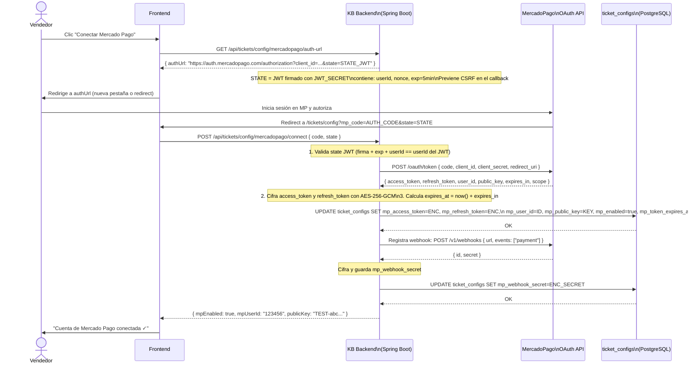

### 5.2 Renovación automática del Token

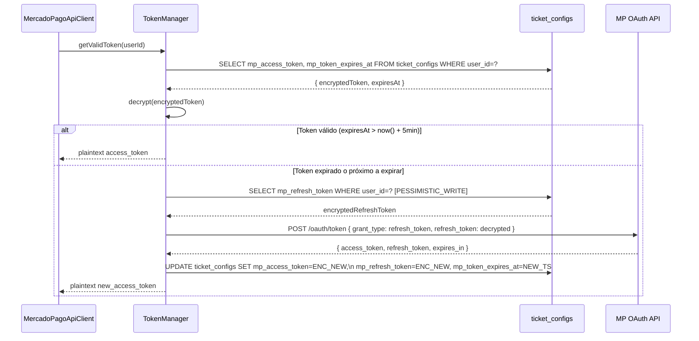

**Lock pesimista en refresh**: Mismo patrón que la numeración de tickets (`@Lock(PESSIMISTIC_WRITE)`) para evitar que dos threads simultáneos intenten renovar el mismo token y generen conflictos.

### 5.3 Desconexión

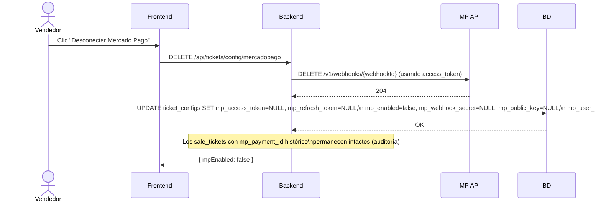

---

## 6. Payments — Creación de Preferencias y Consulta

### 6.1 Crear Preferencia (initiar pago)

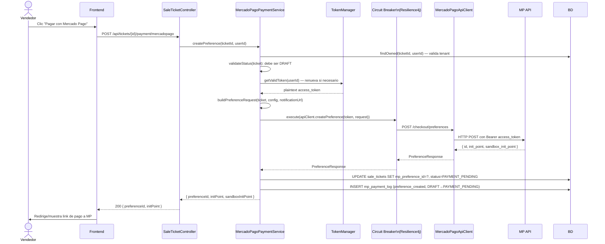

### 6.2 Consultar estado de pago (polling fallback)

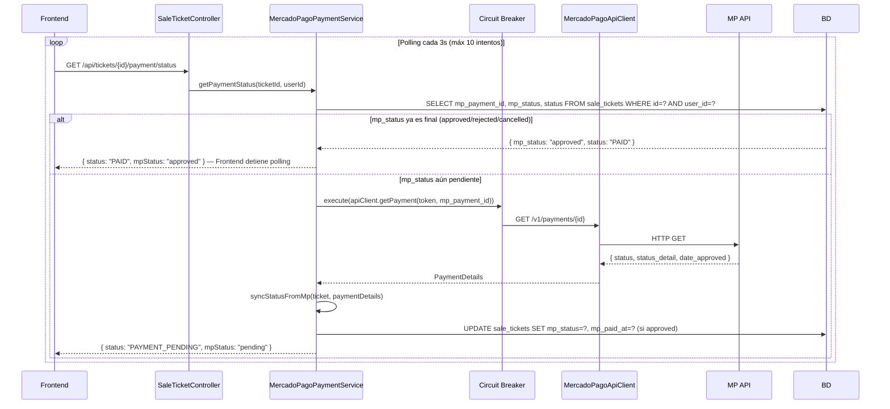

### 6.3 Reembolso

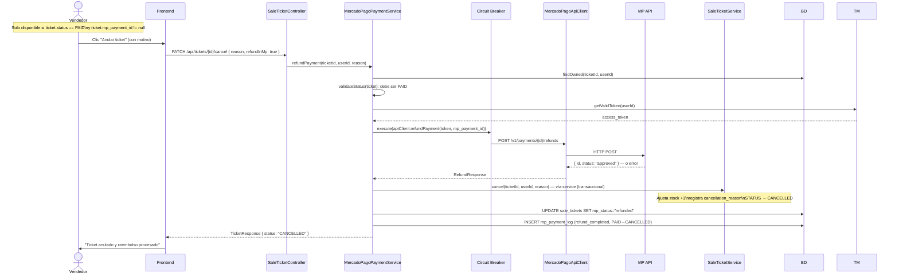

---

## 7. Circuit Breaker — Resiliencia contra fallos de MP

### 7.1 Por qué es necesario

La API de Mercado Pago puede:
- Responder lento (timeout) en picos de tráfico
- Retornar 503 (mantenimiento programado)
- Fallar intermitentemente (errores 5xx transitorios)

Sin Circuit Breaker, un fallo de MP se propaga: el vendedor ve error 500, los requests se acumulan en el pool de threads, el pool se satura, otras funciones del sistema (no relacionadas con MP) también fallan.

### 7.2 Configuración del Circuit Breaker (Resilience4j)

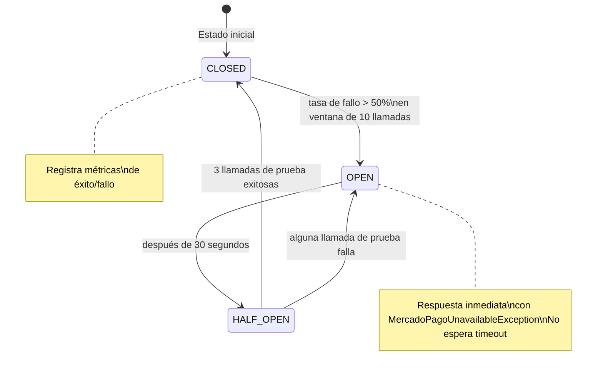

**Configuración por operación:**

| Operación | Timeout | Reintentos | Circuit Breaker | Fallback |
|-----------|---------|-----------|----------------|---------|
| `createPreference()` | 10s | 2 (backoff 1s, 3s) | Ventana 10 calls, fallo >50% | Error al usuario: "MP no disponible, use otro método" |
| `getPayment()` | 8s | 3 (backoff 1s, 2s, 5s) | Mismo | Retorna cached status de BD |
| `refundPayment()` | 15s | 1 (sin retry — idempotente) | Mismo | Error al usuario: "Reintente en unos minutos" |
| `refreshToken()` | 10s | 2 | Propio (más permisivo) | Log error + alerta admin |
| `registerWebhook()` | 10s | 2 | Independiente | Solo log — no crítico al momento |

### 7.3 Flujo del Circuit Breaker

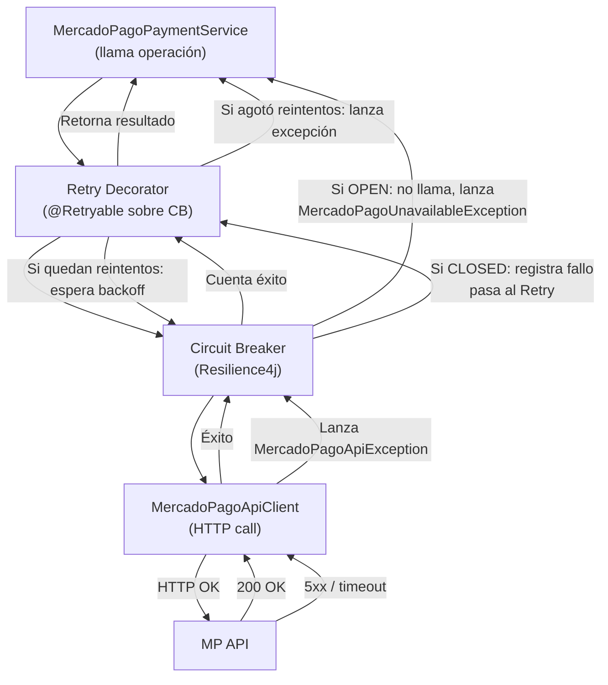

**Orden de decoradores** (importante — el orden afecta el comportamiento):
```
Request → TimeLimiter → CircuitBreaker → Retry → MercadoPagoApiClient
```
El `TimeLimiter` va primero para asegurar que los reintentos no excedan el tiempo total. El `Retry` va último para reintentar solo si el Circuit Breaker está CLOSED.

---

## 8. Webhooks — Idempotencia y Procesamiento Seguro

### 8.1 Flujo completo del webhook

```mermaid
sequenceDiagram
    participant MP as Mercado Pago
    participant WC as WebhookController
    participant WV as WebhookValidator
    participant WP as WebhookProcessor\n(@Async)
    participant WER as WebhookEventRepository
    participant MPS as MercadoPagoPaymentService
    participant STS as SaleTicketService
    participant ES as EmailService
    participant BD

    MP->>WC: POST /api/webhooks/mercadopago\nHeaders: x-signature: ts=...,v1=HMAC\nBody: { type: "payment", data: { id: "123" } }

    WC->>WV: validate(requestBody, xSignature, vendorUserId)
    Note over WV: 1. Extrae ts y v1 del header\n2. Construye mensaje: id:{id};request-id:{reqId};ts:{ts};\n3. Obtiene mp_webhook_secret del tenant (CIFRADO → descifrado)\n4. HMAC-SHA256(secret, message)\n5. Compara con timing-safe MessageDigest.isEqual()\n6. Verifica que ts no tenga más de 5 minutos de antigüedad
    WV-->>WC: valid / throws WebhookSignatureException

    WC->>BD: INSERT mp_webhook_events (external_id="payment:123", status=received, raw_body, correlation_id)
    Note over BD: Si external_id ya existe → DuplicateKeyException\n→ WebhookController responde 200 OK silenciosamente\n(MP deja de reintentar)

    WC-->>MP: 200 OK (respuesta INMEDIATA — antes de procesar)
    Note over WC: Responder 200 ANTES del procesamiento\nMP no espera más de 5s antes de reintentar

    WC->>WP: processAsync(webhookEventId, topic, externalId)
    Note over WC,WP: Procesamiento es @Async — decoupled del HTTP thread

    WP->>BD: UPDATE mp_webhook_events SET status=processing
    WP->>MPS: handlePaymentWebhook(externalPaymentId, vendorUserId, correlationId)
    MPS->>MPS: getValidToken(userId) — via TokenManager
    MPS->>BD: GET /v1/payments/{externalPaymentId} — via Circuit Breaker
    Note over MPS: Siempre consulta el estado real en MP\nNo confía solo en el body del webhook (puede estar desactualizado)

    alt MP status = "approved"
        MPS->>STS: confirmPayment(ticketId, mpPaymentId, mpStatus, paidAt)
        STS->>BD: UPDATE sale_tickets SET status=PAID, mp_status=approved, mp_paid_at=TS
        STS->>STS: adjustStock(items, delta=-1, userId)
        STS->>BD: INSERT mp_payment_log (payment_received, PAYMENT_PENDING→PAID)
        MPS->>ES: sendPaymentConfirmationEmail(ticket) [async, retryable]
    else MP status = "rejected" or "cancelled"
        MPS->>STS: failPayment(ticketId, mpPaymentId, mpStatus, statusDetail)
        STS->>BD: UPDATE sale_tickets SET status=PAYMENT_FAILED, mp_status_detail=DETAIL
        STS->>BD: INSERT mp_payment_log (payment_failed, PAYMENT_PROCESSING→PAYMENT_FAILED)
    else MP status = "pending" or "in_process"
        MPS->>BD: UPDATE sale_tickets SET status=PAYMENT_PROCESSING, mp_status=pending
        STS->>BD: INSERT mp_payment_log (status_updated)
    end

    WP->>BD: UPDATE mp_webhook_events SET status=processed, processed_at=NOW()
    Note over WP: Si cualquier paso falla:\n→ UPDATE mp_webhook_events SET status=failed, error_message=...\n→ Log con correlationId para debugging
```

### 8.2 Garantía de idempotencia

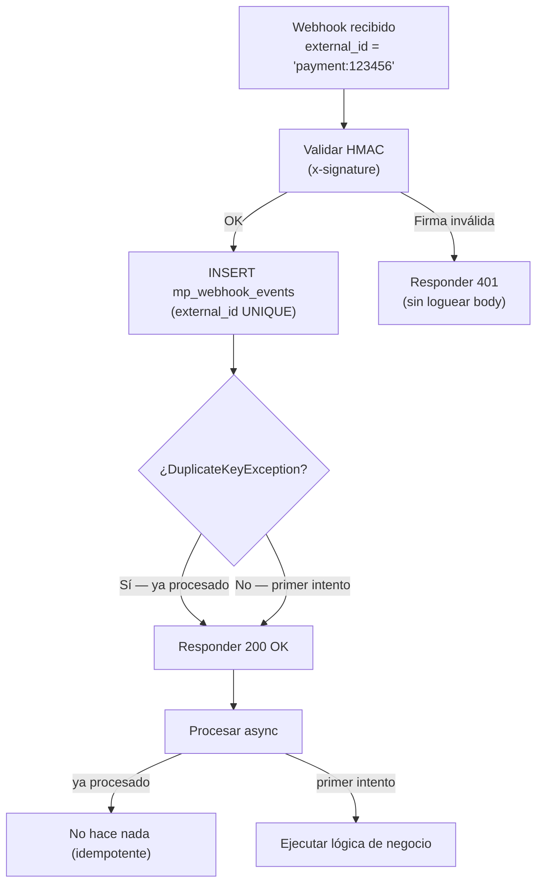

**La garantía**: La restricción `UNIQUE` en `external_id` de `mp_webhook_events` es la línea de defensa a nivel de base de datos. Incluso si dos threads procesan el mismo webhook simultáneamente, solo uno logrará hacer el INSERT exitoso. El otro recibirá `DataIntegrityViolationException` y responderá 200 silenciosamente.

### 8.3 Manejo de webhooks de topics no-payment

| Topic de MP | Acción |
|-------------|--------|
| `payment` | Procesar plenamente (actualizar ticket, stock, email) |
| `merchant_order` | Loguear en `mp_webhook_events`, no procesar (informativo) |
| `chargebacks` | Loguear + notificar al admin vía email (acción manual requerida) |
| Cualquier otro | Loguear como `ignored`, responder 200 |

---

## 9. Observabilidad — Logging, Métricas y Correlation-ID

### 9.1 Correlation ID — Trazabilidad end-to-end

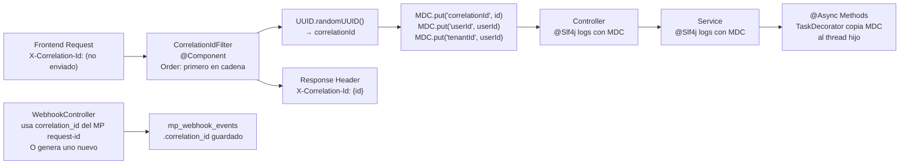

**Logback pattern** (en `logback-spring.xml`):
```
%d{ISO8601} [%thread] %-5level %logger{36} [corr=%X{correlationId}] [user=%X{userId}] - %msg%n
```

Esto permite filtrar todos los logs de una transacción específica con:
```
grep "corr=abc12345" application.log
```

### 9.2 Estrategia de Logging por capa

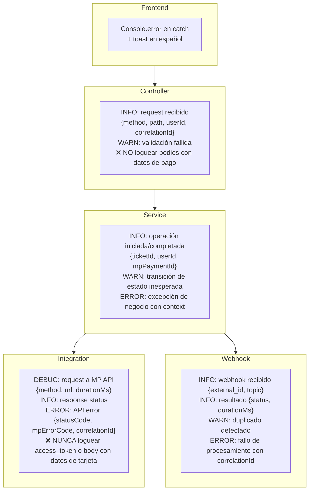

**Regla de oro de logging**: NUNCA loguear `access_token`, `refresh_token`, `webhook_secret`, ni datos de tarjeta. Si se necesita debuggear, loguear solo el `mpPaymentId` y el `userId`.

### 9.3 Métricas con Micrometer (Actuator)

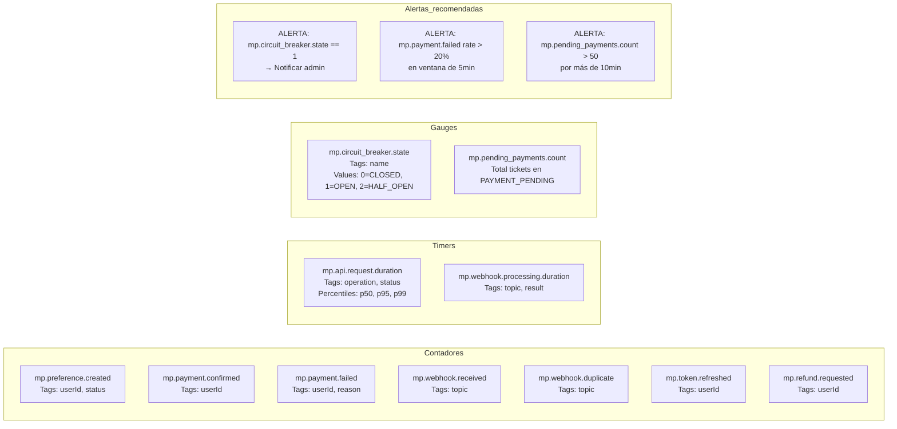

**Endpoint de métricas**: `/actuator/metrics` (solo accesible desde ROLE_ADMIN o IP interna)

### 9.4 Tabla de Logs de Auditoría

`mp_payment_log` funciona como log estructurado inmutable para auditoría financiera:

```
event_type              | Cuándo se registra
------------------------|---------------------------------------------
preference_created      | POST /checkout/preferences exitoso
payment_received        | Webhook topic=payment status=approved
payment_failed          | Webhook topic=payment status=rejected
refund_requested        | POST /v1/payments/{id}/refunds iniciado
refund_completed        | Refund confirmado por MP
token_refreshed         | TokenManager renovó access_token
webhook_duplicate       | External_id ya existía (idempotencia)
status_sync             | Polling: estado sincronizado desde MP
```

---

## 10. Arquitectura de Packages

```
com.jafpsoft.ventas/
│
├── controller/
│   ├── SaleTicketController.java          (+ endpoints /payment/*)
│   ├── TicketConfigController.java        (+ endpoints /mercadopago)
│   └── WebhookController.java             [NUEVO]
│
├── service/
│   ├── SaleTicketService.java             (modificado: TicketStatus enum, confirmPayment, failPayment)
│   ├── MercadoPagoPaymentService.java     [NUEVO] orquestación de pagos
│   └── MercadoPagoOAuthService.java       [NUEVO] conexión/desconexión de cuenta
│
├── integration/
│   └── mercadopago/
│       ├── MercadoPagoApiClient.java      [NUEVO] HTTP calls (con CB)
│       ├── MercadoPagoWebhookValidator.java [NUEVO] HMAC-SHA256
│       ├── MercadoPagoTokenManager.java   [NUEVO] refresh automático
│       └── MercadoPagoWebhookProcessor.java [NUEVO] @Async processor
│
├── model/
│   ├── SaleTicket.java                    (+ mp_preference_id, mp_payment_id, mp_status)
│   ├── TicketConfig.java                  (+ mp_access_token ENCRYPTED, ...)
│   ├── MercadoPagoWebhookEvent.java       [NUEVO]
│   ├── MercadoPagoPaymentLog.java         [NUEVO]
│   └── enums/
│       └── TicketStatus.java              [NUEVO]
│
├── dto/
│   ├── ticket/
│   │   ├── TicketRequest.java
│   │   └── TicketResponse.java            (+ mpStatus, mpPreferenceId)
│   └── payment/                           [NUEVO package]
│       ├── MercadoPagoPreferenceResponse.java
│       ├── MercadoPagoPaymentStatusResponse.java
│       ├── MercadoPagoWebhookDto.java
│       ├── MercadoPagoConnectRequest.java
│       └── MercadoPagoConnectResponse.java
│
├── repository/
│   ├── MercadoPagoWebhookEventRepository.java [NUEVO]
│   └── MercadoPagoPaymentLogRepository.java   [NUEVO]
│
├── security/
│   └── crypto/
│       └── EncryptedStringConverter.java  [NUEVO]
│
├── config/
│   └── AppConfig.java                     (+ @EnableRetry, ResilienceConfig bean)
│
└── exception/
    ├── MercadoPagoException.java           [NUEVO] base
    ├── MercadoPagoApiException.java        [NUEVO]
    ├── MercadoPagoUnavailableException.java [NUEVO]
    ├── MercadoPagoTokenException.java      [NUEVO]
    ├── WebhookSignatureException.java      [NUEVO]
    └── IllegalTicketStateTransitionException.java [NUEVO]
```

---

## 11. Firmas de Métodos y Excepciones

### 11.1 Jerarquía de Excepciones

```
RuntimeException
└── MercadoPagoException(String message, String correlationId)
    ├── MercadoPagoApiException(int statusCode, String mpErrorCode, String message, String correlationId)
    │     Cuándo: MP retorna 4xx/5xx
    ├── MercadoPagoUnavailableException(String message, String correlationId)
    │     Cuándo: Circuit Breaker en OPEN o timeout total agotado
    ├── MercadoPagoTokenException(Long userId, String reason)
    │     Cuándo: access_token inválido, refresh_token expirado, OAuth revocado
    └── WebhookSignatureException(String reason)
          Cuándo: HMAC inválido, timestamp expirado

IllegalStateException
└── IllegalTicketStateTransitionException(TicketStatus from, TicketStatus to, Long ticketId)

RuntimeException
└── CryptoConfigurationException(String message)
      Cuándo: APP_ENCRYPTION_KEY ausente al startup (@PostConstruct)
└── CryptoOperationException(String message, Throwable cause)
      Cuándo: auth tag inválido en GCM decrypt (tampering detectado)
```

### 11.2 `EncryptedStringConverter`

```java
// package: com.jafpsoft.ventas.security.crypto
public class EncryptedStringConverter implements AttributeConverter<String, String> {
    // Retorna null si plaintext es null; Base64(IV+Cipher+Tag) si no
    @Override
    public String convertToDatabaseColumn(String plaintext);
    //   throws: CryptoOperationException (fallo de cifrado)

    // Retorna null si ciphertext es null; descifra y valida auth tag
    @Override
    public String convertToEntityAttribute(String ciphertext);
    //   throws: CryptoOperationException (auth tag inválido = tampering)

    // Llamado al startup de Spring para fail-fast si la key no está
    @PostConstruct
    public void validateKey();
    //   throws: CryptoConfigurationException
}
```

### 11.3 `MercadoPagoApiClient`

```java
// package: com.jafpsoft.ventas.integration.mercadopago
public class MercadoPagoApiClient {

    // Crea preferencia de pago en MP
    // Circuit Breaker: sí | Timeout: 10s | Retries: 2
    public PreferenceResponse createPreference(String accessToken, PreferenceRequest request, String correlationId);
    //   throws: MercadoPagoApiException (4xx), MercadoPagoUnavailableException (CB open / timeout)

    // Consulta el estado de un pago específico
    // Circuit Breaker: sí | Timeout: 8s | Retries: 3
    public PaymentDetails getPayment(String accessToken, String paymentId, String correlationId);
    //   throws: MercadoPagoApiException, MercadoPagoUnavailableException

    // Solicita reembolso total del pago
    // Circuit Breaker: sí | Timeout: 15s | Retries: 1 (refund es idempotente en MP)
    public RefundResponse refundPayment(String accessToken, String paymentId, String correlationId);
    //   throws: MercadoPagoApiException, MercadoPagoUnavailableException

    // Registra una URL de webhook en la cuenta del vendedor
    // Circuit Breaker: propio (más permisivo) | Timeout: 10s | Retries: 2
    public WebhookRegistrationResponse registerWebhook(String accessToken, String notificationUrl, List<String> events);
    //   throws: MercadoPagoApiException, MercadoPagoUnavailableException

    // Elimina el webhook registrado
    public void deleteWebhook(String accessToken, String webhookId);
    //   throws: MercadoPagoApiException (no-op si 404, el webhook ya fue eliminado)
}
```

### 11.4 `MercadoPagoTokenManager`

```java
// package: com.jafpsoft.ventas.integration.mercadopago
public class MercadoPagoTokenManager {

    // Retorna un access_token válido para el userId dado
    // Refresca automáticamente si expira en < 5 minutos
    // Usa @Lock(PESSIMISTIC_WRITE) en ticket_configs para evitar doble refresh
    public String getValidToken(Long userId);
    //   throws: MercadoPagoTokenException (si refresh falla o MP revocó el token)
    //           EntityNotFoundException (si el tenant no tiene MP conectado)

    // Intercambia el authorization_code por access_token + refresh_token
    // Solo llamado desde MercadoPagoOAuthService.connectAccount()
    public TokenExchangeResult exchangeAuthorizationCode(String authCode, String redirectUri);
    //   throws: MercadoPagoApiException (código inválido o expirado)

    // Invalida tokens locales sin llamar a MP (para disconnect)
    @Transactional
    public void revokeLocalTokens(Long userId);
}
```

### 11.5 `MercadoPagoOAuthService`

```java
// package: com.jafpsoft.ventas.service
public class MercadoPagoOAuthService {

    // Genera la URL de autorización de MP con state JWT firmado
    // state = JWT(userId, nonce, exp=5min) — previene CSRF
    public String buildAuthorizationUrl(Long userId);

    // Procesa el callback: valida state, intercambia code, guarda tokens cifrados
    @Transactional
    public MercadoPagoConnectResponse connectAccount(Long userId, String authCode, String state);
    //   throws: IllegalArgumentException (state inválido o expirado)
    //           MercadoPagoApiException (exchange fallido)
    //           MercadoPagoTokenException (scope insuficiente)

    // Retorna el estado de conexión MP del tenant (sin exponer access_token)
    public MercadoPagoStatusResponse getConnectionStatus(Long userId);

    // Desconecta la cuenta: elimina webhook en MP, limpia campos en TicketConfig
    @Transactional
    public void disconnectAccount(Long userId);
    //   throws: EntityNotFoundException (si no tiene cuenta conectada)
}
```

### 11.6 `MercadoPagoPaymentService`

```java
// package: com.jafpsoft.ventas.service
public class MercadoPagoPaymentService {

    // Crea preferencia en MP y transiciona ticket DRAFT→PAYMENT_PENDING
    @Transactional
    public MercadoPagoPreferenceResponse createPreference(Long ticketId, Long userId, String correlationId);
    //   throws: EntityNotFoundException (ticket no encontrado)
    //           IllegalTicketStateTransitionException (ticket no está en DRAFT)
    //           MercadoPagoTokenException (MP no conectado o token inválido)
    //           MercadoPagoUnavailableException (CB open)

    // Consulta estado actual: primero en BD, luego en MP si está pendiente
    public MercadoPagoPaymentStatusResponse getPaymentStatus(Long ticketId, Long userId, String correlationId);
    //   throws: EntityNotFoundException

    // Inicia reembolso en MP y transiciona ticket PAID→CANCELLED
    @Transactional
    public TicketResponse refundPayment(Long ticketId, Long userId, String reason, String correlationId);
    //   throws: IllegalTicketStateTransitionException (ticket no está en PAID)
    //           MercadoPagoApiException (reembolso rechazado por MP)

    // Confirma un pago aprobado (llamado desde WebhookProcessor)
    @Transactional
    public void confirmPayment(Long ticketId, String mpPaymentId, String mpStatus, LocalDateTime paidAt, String correlationId);
    //   throws: IllegalTicketStateTransitionException

    // Registra fallo de pago (llamado desde WebhookProcessor)
    @Transactional
    public void failPayment(Long ticketId, String mpPaymentId, String mpStatus, String statusDetail, String correlationId);

    // Permite reintentar un pago fallido: PAYMENT_FAILED→DRAFT, limpia mp_preference_id
    @Transactional
    public TicketResponse resetPaymentAttempt(Long ticketId, Long userId);
    //   throws: IllegalTicketStateTransitionException (solo desde PAYMENT_FAILED)
}
```

### 11.7 `MercadoPagoWebhookValidator`

```java
// package: com.jafpsoft.ventas.integration.mercadopago
public class MercadoPagoWebhookValidator {

    // Valida la firma del webhook contra el secret del tenant
    // Previene: CSRF, replay attacks (max 5min), tampering del body
    public void validate(String requestBody, String xSignatureHeader, Long vendorUserId);
    //   throws: WebhookSignatureException("HMAC_MISMATCH") — firma inválida
    //           WebhookSignatureException("TIMESTAMP_EXPIRED") — ts > 5 minutos
    //           WebhookSignatureException("INVALID_FORMAT") — header malformado
    //           EntityNotFoundException — tenant no tiene webhook secret configurado

    // Extrae el vendorUserId del requestParam o body del webhook
    // MP incluye el user.id del vendedor en el webhook
    public Long extractVendorUserId(Map<String, String> requestParams, String body);
    //   throws: IllegalArgumentException (si no se puede extraer)
}
```

### 11.8 `MercadoPagoWebhookProcessor`

```java
// package: com.jafpsoft.ventas.integration.mercadopago
public class MercadoPagoWebhookProcessor {

    // Procesa el webhook de forma asíncrona
    // El @Async copia el MDC para mantener el correlationId
    @Async
    public void processAsync(Long webhookEventId, String topic, String externalId, Long vendorUserId, String correlationId);

    // Maneja específicamente eventos de tipo payment
    // SIEMPRE consulta el estado real en MP (no confía en el body del webhook)
    // Retryable: 3 reintentos con backoff exponencial si falla la consulta a MP
    @Retryable(retryFor = MercadoPagoUnavailableException.class, maxAttempts = 3,
               backoff = @Backoff(delay = 2000, multiplier = 2))
    void handlePaymentEvent(String mpPaymentId, Long vendorUserId, Long webhookEventId, String correlationId);
    //   throws: MercadoPagoUnavailableException (agotados reintentos)
    //           MercadoPagoApiException (error de MP — registra como failed)
}
```

### 11.9 `WebhookController`

```java
// package: com.jafpsoft.ventas.controller
// Ruta: POST /api/webhooks/mercadopago — sin autenticación JWT
@RestController
@RequestMapping("/api/webhooks")
public class WebhookController {

    // Punto de entrada para notificaciones de Mercado Pago (IPN)
    // 1. Valida HMAC — responde 401 si inválido (sin loguear body)
    // 2. Intenta INSERT en mp_webhook_events — si duplicado, responde 200 silencioso
    // 3. Responde 200 INMEDIATAMENTE (antes de procesar)
    // 4. Delega procesamiento a @Async WebhookProcessor
    @PostMapping("/mercadopago")
    @RateLimiter(name = "mp-webhook")  // 200 req/min por IP
    public ResponseEntity<Void> handleMercadoPagoWebhook(
        @RequestBody String rawBody,
        @RequestHeader("x-signature") String xSignature,
        @RequestHeader(value = "x-request-id", required = false) String requestId,
        @RequestParam Map<String, String> params
    );
    //   returns: 200 siempre (si firma válida) — MP reintenta si recibe otro status
    //   returns: 401 si WebhookSignatureException (para no dar info al atacante, loguear internamente)
}
```

### 11.10 `SaleTicketController` — Nuevos endpoints

```java
// Endpoints nuevos en el SaleTicketController existente

// Inicia el proceso de pago con MP — crea preferencia y retorna link
@PostMapping("/{id}/payment/mercadopago")
@RateLimiter(name = "mp-create-payment")  // 10 req/min por usuario
public ResponseEntity<MercadoPagoPreferenceResponse> createMercadoPagoPayment(
    @PathVariable Long id,
    @AuthenticationPrincipal CustomUserDetails user,
    @RequestHeader(value = "X-Correlation-Id", required = false) String correlationId
);
//   throws → 404 NOT_FOUND si ticket no existe
//   throws → 409 CONFLICT si ticket no está en DRAFT (IllegalTicketStateTransitionException)
//   throws → 503 SERVICE_UNAVAILABLE si MP no disponible (MercadoPagoUnavailableException)
//   throws → 424 FAILED_DEPENDENCY si MP no está conectado (MercadoPagoTokenException)

// Consulta el estado actual del pago — para polling del frontend
@GetMapping("/{id}/payment/status")
public ResponseEntity<MercadoPagoPaymentStatusResponse> getPaymentStatus(
    @PathVariable Long id,
    @AuthenticationPrincipal CustomUserDetails user,
    @RequestHeader(value = "X-Correlation-Id", required = false) String correlationId
);

// Reinicia un pago fallido para que el vendedor pueda intentar de nuevo
@PostMapping("/{id}/payment/reset")
public ResponseEntity<TicketResponse> resetPaymentAttempt(
    @PathVariable Long id,
    @AuthenticationPrincipal CustomUserDetails user
);
//   throws → 409 CONFLICT si ticket no está en PAYMENT_FAILED
```

### 11.11 `TicketConfigController` — Endpoints OAuth

```java
// Endpoints para la conexión de cuenta MP del vendedor

// Genera la URL de autorización de MP para redirigir al frontend
@GetMapping("/mercadopago/auth-url")
public ResponseEntity<Map<String, String>> getMercadoPagoAuthUrl(
    @AuthenticationPrincipal CustomUserDetails user
);
//   returns: { authUrl: "https://auth.mercadopago.com/..." }

// Procesa el callback OAuth: intercambia code → tokens, registra webhook
@PostMapping("/mercadopago/connect")
public ResponseEntity<MercadoPagoConnectResponse> connectMercadoPago(
    @RequestBody MercadoPagoConnectRequest request,  // { code, state }
    @AuthenticationPrincipal CustomUserDetails user
);
//   throws → 400 BAD_REQUEST si state inválido o expirado
//   throws → 502 BAD_GATEWAY si MP rechaza el code

// Retorna estado de conexión (publicKey si conectado, mpEnabled, mpUserId)
// NUNCA retorna access_token ni refresh_token
@GetMapping("/mercadopago/status")
public ResponseEntity<MercadoPagoConnectResponse> getMercadoPagoStatus(
    @AuthenticationPrincipal CustomUserDetails user
);

// Desconecta la cuenta: limpia tokens en BD, elimina webhook en MP
@DeleteMapping("/mercadopago")
public ResponseEntity<Void> disconnectMercadoPago(
    @AuthenticationPrincipal CustomUserDetails user
);
```

### 11.12 Manejo en `GlobalExceptionHandler` — Excepciones nuevas

```java
// Agregar al GlobalExceptionHandler existente:

@ExceptionHandler(MercadoPagoUnavailableException.class)
// → 503 SERVICE_UNAVAILABLE
// message: "El servicio de pagos no está disponible en este momento. Intentá más tarde."

@ExceptionHandler(MercadoPagoApiException.class)
// → 502 BAD_GATEWAY (si error de MP) o 400 BAD_REQUEST (si datos inválidos)
// message: Mensaje traducido del código de error de MP (ver catálogo MP)

@ExceptionHandler(MercadoPagoTokenException.class)
// → 424 FAILED_DEPENDENCY
// message: "Tu cuenta de Mercado Pago no está conectada o la conexión venció. Reconectá tu cuenta."

@ExceptionHandler(WebhookSignatureException.class)
// → 401 UNAUTHORIZED
// message: "Solicitud inválida." (genérico, no exponer por qué falló la firma)
// Log interno: WARNING con correlationId y motivo real

@ExceptionHandler(IllegalTicketStateTransitionException.class)
// → 409 CONFLICT
// message: "Esta operación no es válida para el estado actual del comprobante."

@ExceptionHandler(CryptoOperationException.class)
// → 500 INTERNAL_SERVER_ERROR
// message: "Error interno. Contactá al soporte."
// Log interno: CRITICAL — posible tampering de datos en BD
```

---

## 12. Diagrama de Componentes Completo

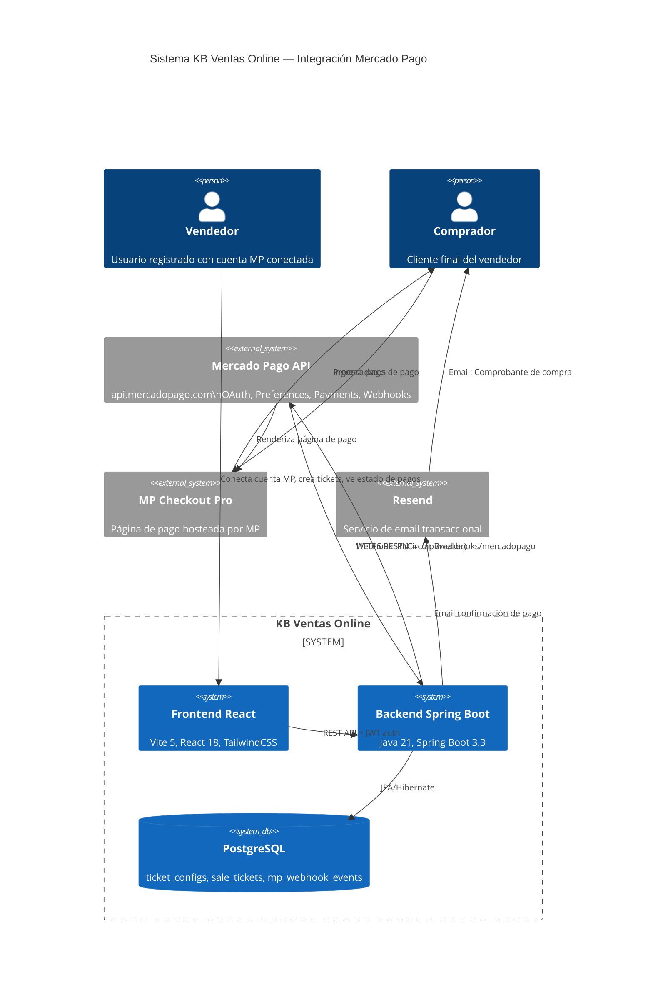

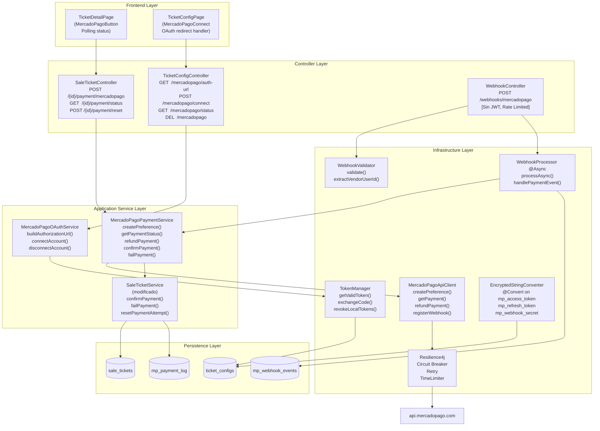

---

## 13. Matriz de Decisiones

| Decisión | Opción A | Opción B | **Elegida** | Razón |
|----------|----------|----------|-------------|-------|
| **Cifrado** | AES-256-CBC | AES-256-GCM | **GCM** | Autenticación de cifrado (AEAD): detecta tampering |
| **Storage de tokens MP** | Tabla separada `mp_credentials` | Extender `TicketConfig` | **TicketConfig** | Ya es 1:1 con tenant; no duplicar aislamiento |
| **Idempotencia** | Campo `processed` en `sale_tickets` | Tabla `mp_webhook_events` | **Tabla separada** | Registra intentos fallidos; soporta múltiples topics |
| **Circuit Breaker** | Sentinel | Resilience4j | **Resilience4j** | Ya tiene compatibilidad con Spring Boot Actuator; más adoptado en ecosistema Spring |
| **OAuth State** | UUID aleatorio en sesión | JWT firmado con JWT_SECRET | **JWT firmado** | Stateless; no requiere sesión; expira solo; verifica userId |
| **Retry de webhook** | En WebhookController (sync) | En WebhookProcessor (@Async + @Retryable) | **@Async + @Retryable** | Responder 200 a MP inmediatamente; reintentos internos transparentes |
| **Refund** | Automático al cancelar | Opcional al cancelar (flag refundInMp) | **Opcional** | No todos los vendedores querrán reembolsar; algunos prefieren crédito en tienda |
| **Polling de estado** | WebSocket push | Polling REST cada 3s | **Polling** | Más simple; WebSocket ya existe pero agrega complejidad sin beneficio claro para este flujo |
| **MP Checkout** | Custom Brick (embedded) | Checkout Pro (redirect/popup) | **Checkout Pro** | Sin responsabilidad PCI sobre datos de tarjeta; MP maneja la seguridad del formulario |
| **Rate Limiting** | Nginx/proxy | Bucket4j en la app | **Bucket4j** | Sin control de proxy en Render Hobby; in-app es portable |

---

## Apéndice — Variables de Entorno Requeridas

### Backend (agregar en Render)

| Variable | Descripción | Sensible | Ejemplo |
|----------|-------------|---------|---------|
| `APP_ENCRYPTION_KEY` | Clave AES-256 (32 bytes hex) | **Sí** | `openssl rand -hex 32` |
| `MP_CLIENT_ID` | Client ID de la app en MP Developers | No | `123456789` |
| `MP_CLIENT_SECRET` | Client Secret de la app MP | **Sí** | `abc123...` |
| `MP_REDIRECT_URI` | URI de callback del OAuth | No | `https://app.com/tickets/config` |
| `MP_NOTIFICATION_URL` | Base URL para webhooks (backend) | No | `https://api.app.com/api` |

### Frontend (agregar en Vercel)

| Variable | Descripción | Ejemplo |
|----------|-------------|---------|
| `VITE_MP_OAUTH_REDIRECT` | URI de callback visible en el browser | `https://app.com/tickets/config` |

> Los `access_token` y `webhook_secret` de cada vendedor NO son variables de entorno — se guardan en BD cifrada, aislados por tenant.
