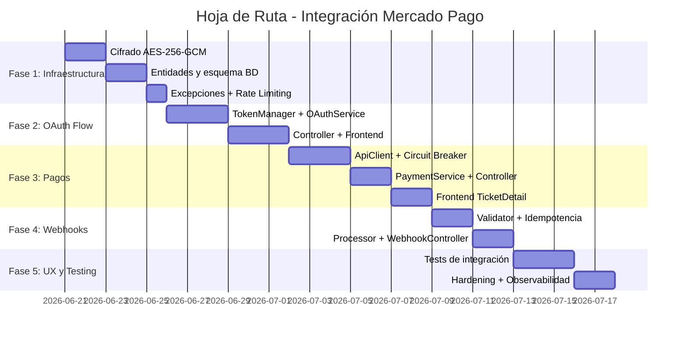

# Plan de Implementación — Integración Mercado Pago
> Hoja de Ruta · Branch: `feature/mercadopago` · Target: v1.004.00 · 2026-06-20  
> Basado en: `docs/mercadopago-analysis.md` · `docs/mercadopago-architecture.md`

---

## Cómo leer este documento

Cada fase es una unidad de trabajo **desplegable de forma independiente**. Al final de cada fase el sistema debe compilar, los tests deben pasar y el feature parcial no debe romper funcionalidad existente. Las fases son secuenciales: cada una depende de que la anterior esté completa y mergeada al branch `feature/mercadopago`.

**Convención de símbolos:**
- `[B]` → archivo Backend (Java/Spring Boot)
- `[F]` → archivo Frontend (React/Vite)
- `[DB]` → cambio de esquema de base de datos
- `[NEW]` → archivo nuevo
- `[MOD]` → archivo existente modificado
- `[DEP]` → dependencia Maven o npm

---

## Resumen de Fases



---

## FASE 1 — Infraestructura de Seguridad y Persistencia

### Objetivo

Construir los cimientos sobre los cuales se apoya toda la integración: cifrado de datos sensibles en reposo, el modelo de datos nuevo, la máquina de estados del ticket, la jerarquía de excepciones y el rate limiting. **Nada de lógica de MP todavía.** Al finalizar esta fase, la base de datos tiene las columnas necesarias, los campos sensibles son cifrados transparentemente por JPA, y las nuevas excepciones están registradas en el handler global.

**Criterio de éxito de la fase**: `mvn test` pasa, el backend levanta en local con las nuevas columnas, ninguna funcionalidad existente regresa.

---

### 1.1 Dependencias Maven (agregar primero)

**Archivo:** `[B][MOD]` `backend/pom.xml`

**Dependencias a agregar y por qué:**

| Dependencia | Grupo/Artefacto | Por qué en esta fase |
|------------|----------------|---------------------|
| Spring Retry | `spring-retry` | Necesario para `@Retryable` en webhooks y email de pago |
| AOP (Spring Retry lo requiere) | `spring-boot-starter-aop` | Spring Retry usa AOP proxy para interceptar métodos |
| Resilience4j Spring Boot | `resilience4j-spring-boot3` | Circuit Breaker, TimeLimiter, Retry decorators |
| Bucket4j (Rate Limiting) | `bucket4j-core` | Rate limiting sin proxy externo |
| Bucket4j Spring | `bucket4j-spring-boot-starter` | Auto-configuración con Spring |
| Micrometer (Métricas) | Ya incluido por Spring Boot Actuator | Verificar que `spring-boot-starter-actuator` esté presente |

**Orden de adición**: Primero `spring-retry` + `spring-boot-starter-aop` porque se necesitan antes de cualquier `@Retryable`. Luego `resilience4j`. Bucket4j puede agregarse antes del Fase 3 pero conviene tenerlo disponible para las pruebas.

**Riesgo**: `resilience4j-spring-boot3` trae transitivamente `spring-boot-starter-actuator`. Si ya existe con versión diferente puede haber conflicto. Verificar con `mvn dependency:tree`.

---

### 1.2 Cifrado AES-256-GCM — `EncryptedStringConverter`

**Prerrequisito**: No tiene prerequisitos. Es la pieza más independiente del sistema.

**Archivos:**

| Archivo | Tipo | Descripción |
|---------|------|-------------|
| `[B][NEW]` `security/crypto/EncryptedStringConverter.java` | Converter JPA | Cifra/descifra con AES-256-GCM |
| `[B][NEW]` `security/crypto/CryptoConfigurationException.java` | Exception | Falla en startup si APP_ENCRYPTION_KEY falta |
| `[B][NEW]` `security/crypto/CryptoOperationException.java` | Exception | Falla de encrypt/decrypt (tampering detectado) |
| `[B][NEW]` `security/crypto/EncryptedStringConverterTest.java` | Test | JUnit 5, sin BD |

**Pasos en orden:**
1. Crear `CryptoConfigurationException` y `CryptoOperationException` (primero las excepciones porque el Converter las lanza)
2. Crear `EncryptedStringConverter` que inyecta `APP_ENCRYPTION_KEY` via `@Value`
3. Agregar `@PostConstruct validateKey()` para fail-fast si la key no está configurada o tiene longitud incorrecta
4. Agregar `APP_ENCRYPTION_KEY=<32-bytes-hex>` al `.env` local (NO commitear)
5. Escribir test unitario `EncryptedStringConverterTest`: cifrar un string → descifrar → debe ser igual al original; alterar el ciphertext → debe lanzar `CryptoOperationException`

**Riesgo**: Si `APP_ENCRYPTION_KEY` no está en el entorno de Render al momento del deploy, el contexto de Spring falla al levantar con `CryptoConfigurationException`. Plan de mitigación: agregar la variable en Render ANTES de deployar esta fase, y verificar con el endpoint `/api/health`.

**Rollback**: Eliminar `EncryptedStringConverter` y sus excepciones. No hay cambios en BD en este paso.

---

### 1.3 Entidad `MercadoPagoWebhookEvent`

**Prerrequisito**: Ninguno (entidad independiente de otras nuevas).

**Archivos:**

| Archivo | Tipo | Descripción |
|---------|------|-------------|
| `[B][NEW]` `model/MercadoPagoWebhookEvent.java` | Entity JPA | Tabla `mp_webhook_events` — log de idempotencia |
| `[B][NEW]` `repository/MercadoPagoWebhookEventRepository.java` | Repository | `findByExternalId()`, `existsByExternalId()` |

**Campos de la entidad:**
```
id                BIGSERIAL PK
external_id       VARCHAR(100) — UNIQUE (constraint de idempotencia)
topic             VARCHAR(50)  — "payment", "merchant_order", "chargebacks"
vendor_user_id    BIGINT       — tenant isolation
status            VARCHAR(20)  — "received", "processing", "processed", "failed", "ignored"
raw_body          TEXT         — body original del webhook
correlation_id    VARCHAR(36)  — para trazabilidad cross-log
error_message     TEXT         — si status=failed
processed_at      TIMESTAMP
created_at        TIMESTAMP    — NOT NULL, @CreationTimestamp
```

**Notas de implementación:**
- `external_id` formato: `"payment:123456789"` — concatenar topic + ":" + id del objeto MP
- `@Column(unique = true)` en `external_id` genera el índice único que garantiza idempotencia
- No tiene `@Convert` en ningún campo (no hay datos sensibles aquí)
- `vendor_user_id` nullable porque al recibir el webhook inicial puede no saberse todavía el tenant

**Riesgo con `ddl-auto=update`**: Hibernate crea la tabla con el UNIQUE constraint correctamente. Sin embargo, si la tabla ya existe de un intento anterior sin el UNIQUE, la migración fallará. Solución: verificar en Render que la tabla no exista antes del primer deploy de esta fase.

---

### 1.4 Entidad `MercadoPagoPaymentLog`

**Prerrequisito**: `SaleTicket` debe existir (ya existe). `TicketStatus` enum (paso 1.6).

**Archivos:**

| Archivo | Tipo | Descripción |
|---------|------|-------------|
| `[B][NEW]` `model/MercadoPagoPaymentLog.java` | Entity JPA | Tabla `mp_payment_log` — auditoría financiera |
| `[B][NEW]` `repository/MercadoPagoPaymentLogRepository.java` | Repository | `findBySaleTicketIdOrderByCreatedAtDesc()` |

**Campos de la entidad:**
```
id                BIGSERIAL PK
sale_ticket_id    BIGINT FK → sale_tickets.id (ON DELETE SET NULL)
vendor_user_id    BIGINT   — redundante con ticket pero facilita queries sin JOIN
mp_payment_id     VARCHAR(50)
event_type        VARCHAR(50)  — ver tabla de eventos en arquitectura
old_status        VARCHAR(30)  — TicketStatus antes del cambio
new_status        VARCHAR(30)  — TicketStatus después del cambio
metadata          TEXT         — JSON con datos adicionales de MP (sin datos sensibles)
correlation_id    VARCHAR(36)
created_at        TIMESTAMP NOT NULL @CreationTimestamp
```

**Por qué `ON DELETE SET NULL` en sale_ticket_id**: Los logs de auditoría deben persistir aunque el ticket sea eliminado (por compliance). El `sale_ticket_id` quedará NULL pero el registro histórico permanece.

---

### 1.5 Extensión de `TicketConfig` — Campos MP

**Prerrequisito**: `EncryptedStringConverter` (paso 1.2) debe estar creado y compilando.

**Archivos:**

| Archivo | Tipo | Descripción |
|---------|------|-------------|
| `[B][MOD]` `model/TicketConfig.java` | Entity JPA | Agregar campos MP (sensibles y no sensibles) |
| `[B][MOD]` `dto/ticket/TicketConfigResponse.java` | DTO | Agregar campos MP públicos; remover nextTicketNumber |
| `[B][MOD]` `dto/ticket/TicketConfigRequest.java` | DTO | NO agregar campos MP aquí (tienen su propio endpoint/DTO) |

**Campos a agregar a `TicketConfig`** (en orden de menor a mayor riesgo):

```
mp_user_id         BIGINT      — plain text, ID del vendedor en MP
mp_public_key      VARCHAR(100) — plain text, va al frontend
mp_enabled         BOOLEAN DEFAULT false — sin cifrado
mp_scope           VARCHAR(200) — plain text, scopes concedidos
mp_connected_at    TIMESTAMP   — plain text

mp_access_token    TEXT @Convert(EncryptedStringConverter) — CIFRADO
mp_refresh_token   TEXT @Convert(EncryptedStringConverter) — CIFRADO
mp_webhook_secret  TEXT @Convert(EncryptedStringConverter) — CIFRADO
mp_webhook_id      VARCHAR(50) — plain text, ID del webhook registrado en MP
mp_token_expires_at TIMESTAMP  — plain text (es metadata, no el token)
```

**Regla crítica de `ddl-auto=update`**: Todos los campos nuevos deben ser **nullable** (sin `nullable=false`). PostgreSQL rechaza agregar columnas `NOT NULL` sin default a tablas con filas existentes. `mp_enabled` es la excepción: usar `columnDefinition = "boolean not null default false"`.

**Cambio en `TicketConfigResponse`**:
- Agregar: `mpEnabled`, `mpUserId`, `mpPublicKey`, `mpConnectedAt` (para mostrar en UI)
- Remover: `nextTicketNumber`, `nextNcNumber`, `nextNdNumber` (información operativa que no debe exponerse)
- NUNCA incluir: `mpAccessToken`, `mpRefreshToken`, `mpWebhookSecret`

**Riesgo**: Si `EncryptedStringConverter.validateKey()` falla al startup (key ausente), Hibernate no llega a mapear las entidades y todo el contexto Spring cae. Por eso el orden es crítico: configurar `APP_ENCRYPTION_KEY` en Render ANTES de deployar.

---

### 1.6 Extensión de `SaleTicket` — Campos MP

**Prerrequisito**: `TicketStatus` enum (paso 1.7 — hacerlo en paralelo, no hay dependencia directa).

**Archivos:**

| Archivo | Tipo | Descripción |
|---------|------|-------------|
| `[B][MOD]` `model/SaleTicket.java` | Entity JPA | Agregar campos MP + migrar status a enum |
| `[B][MOD]` `dto/ticket/TicketResponse.java` | DTO | Agregar mpStatus, mpPreferenceId |

**Campos a agregar a `SaleTicket`** (todos nullable):
```
mp_preference_id    VARCHAR(100) — ID de preferencia de MP
mp_payment_id       VARCHAR(100) — ID del pago confirmado
mp_status           VARCHAR(30)  — estado en MP: pending/approved/rejected/cancelled/refunded
mp_status_detail    VARCHAR(100) — detalle de rechazo
mp_paid_at          TIMESTAMP    — momento de aprobación
```

**Migración del campo `status`**: El campo `status` pasa de `VARCHAR` a mapear el enum `TicketStatus`. El mapeo es `@Enumerated(EnumType.STRING)` para mantener los valores `DRAFT`, `PAID`, `CANCELLED` que ya existen en BD sin migración de datos. Los nuevos valores `PAYMENT_PENDING`, `PAYMENT_PROCESSING`, `PAYMENT_FAILED` simplemente se empiezan a usar. No hay conflicto porque los valores existentes son un subconjunto válido del enum.

---

### 1.7 Enum `TicketStatus`

**Prerrequisito**: Ninguno. Puede hacerse en paralelo con 1.5 y 1.6.

**Archivos:**

| Archivo | Tipo | Descripción |
|---------|------|-------------|
| `[B][NEW]` `model/enums/TicketStatus.java` | Enum | Máquina de estados con `canTransitionTo()` |
| `[B][NEW]` `exception/IllegalTicketStateTransitionException.java` | Exception | Lanzada cuando la transición es inválida |

**Transiciones permitidas** (codificadas en el enum):
```
DRAFT              → PAYMENT_PENDING, PAID, CANCELLED
PAYMENT_PENDING    → PAYMENT_PROCESSING, PAID, PAYMENT_FAILED, CANCELLED
PAYMENT_PROCESSING → PAID, PAYMENT_FAILED
PAYMENT_FAILED     → DRAFT, CANCELLED
PAID               → CANCELLED
CANCELLED          → (ninguna — estado terminal)
```

**Modificación en `SaleTicketService`**: Agregar validación al inicio de `updateStatus()` y `cancel()`. Extraer el `status` actual como `TicketStatus.valueOf(ticket.getStatus())`, llamar a `current.canTransitionTo(next)`, lanzar `IllegalTicketStateTransitionException` si es false.

---

### 1.8 Jerarquía de Excepciones MP

**Prerrequisito**: Ninguno. Mejor hacerlo antes que los services para que estén disponibles.

**Archivos:**

| Archivo | Tipo | Descripción |
|---------|------|-------------|
| `[B][NEW]` `exception/MercadoPagoException.java` | Exception base | Padre de todas las excepciones MP |
| `[B][NEW]` `exception/MercadoPagoApiException.java` | Exception | Error HTTP de la API de MP (4xx/5xx) |
| `[B][NEW]` `exception/MercadoPagoUnavailableException.java` | Exception | Circuit Breaker OPEN o timeout total |
| `[B][NEW]` `exception/MercadoPagoTokenException.java` | Exception | Token inválido, expirado o MP revocó acceso |
| `[B][NEW]` `exception/WebhookSignatureException.java` | Exception | Firma HMAC inválida o timestamp expirado |
| `[B][MOD]` `exception/GlobalExceptionHandler.java` | Handler | Agregar handlers para las excepciones nuevas |

**Mappings HTTP en `GlobalExceptionHandler`:**
```
MercadoPagoUnavailableException → 503 SERVICE_UNAVAILABLE
MercadoPagoApiException         → 502 BAD_GATEWAY (o 400 según mp_error_code)
MercadoPagoTokenException       → 424 FAILED_DEPENDENCY
WebhookSignatureException       → 401 UNAUTHORIZED (mensaje genérico al cliente)
IllegalTicketStateTransitionException → 409 CONFLICT
CryptoOperationException        → 500 INTERNAL_SERVER_ERROR + CRITICAL log
```

---

### 1.9 Configuración de Rate Limiting y Retry

**Prerrequisito**: Dependencias `bucket4j` y `spring-retry` agregadas (paso 1.1).

**Archivos:**

| Archivo | Tipo | Descripción |
|---------|------|-------------|
| `[B][MOD]` `config/AppConfig.java` | Config | Agregar `@EnableRetry`, bean de Resilience4j |
| `[B][NEW]` `config/RateLimitConfig.java` | Config | Configuración de buckets por operación |
| `[B][MOD]` `security/SecurityConfig.java` | Config | Actualizar CORS headers (explícitos, no `*`) |

**Rate limits a configurar:**
```
mp-create-payment  → 10 req/min por userId
mp-webhook         → 200 req/min por IP (más amplio porque MP hace reintentos)
mp-connect         → 5 req/min por userId
mp-token-refresh   → 20 req/min por userId
```

**Cambio en CORS**: Cambiar `setAllowedHeaders(List.of("*"))` por lista explícita:
`Authorization, Content-Type, X-Requested-With, X-Correlation-Id`

---

### Tests de la Fase 1

**Archivos:**

| Archivo | Tipo | Descripción |
|---------|------|-------------|
| `[B][NEW]` `security/crypto/EncryptedStringConverterTest.java` | JUnit 5, sin BD | Encrypt/decrypt/tampering |
| `[B][NEW]` `model/enums/TicketStatusTest.java` | JUnit 5, sin BD | Todas las transiciones válidas e inválidas |
| `[B][NEW]` `service/SaleTicketServiceStateTest.java` | JUnit 5 + Mockito | `updateStatus()` valida transiciones |
| `[B][NEW]` `repository/MercadoPagoWebhookEventRepositoryTest.java` | JUnit 5 + Testcontainers | INSERT duplicado → `DataIntegrityViolationException` |

**Test crítico de Testcontainers — `MercadoPagoWebhookEventRepositoryTest`:**

Este test debe verificar la **garantía de idempotencia a nivel de BD** porque es el mecanismo más importante de toda la integración:

```
Arrange: contenedor PostgreSQL levantado por @Testcontainers
Act:     INSERT mp_webhook_events con external_id="payment:123"
         Segundo INSERT con mismo external_id="payment:123"
Assert:  El segundo INSERT lanza DataIntegrityViolationException
         Solo hay 1 registro en la tabla con external_id="payment:123"
```

**Cobertura mínima de la Fase 1:**
- `EncryptedStringConverter`: 100% de líneas
- `TicketStatus.canTransitionTo()`: todas las combinaciones (matriz de 30 casos)
- `GlobalExceptionHandler`: cada nueva excepción → HTTP status correcto

---

### Plan de Rollback — Fase 1

| Paso a revertir | Comando/Acción | Impacto |
|----------------|---------------|---------|
| Columnas en `ticket_configs` | `ALTER TABLE ticket_configs DROP COLUMN mp_access_token, ...` (manual en Render) | Solo si las columnas se crearon |
| Columnas en `sale_tickets` | `ALTER TABLE sale_tickets DROP COLUMN mp_preference_id, ...` | Solo si se crearon |
| Tabla `mp_webhook_events` | `DROP TABLE mp_webhook_events` | Sin datos de producción todavía |
| Tabla `mp_payment_log` | `DROP TABLE mp_payment_log` | Sin datos de producción todavía |
| Código | `git revert` de los commits de Fase 1 o cherry-pick de commits anteriores | Compilar y redeploy |
| `APP_ENCRYPTION_KEY` | Dejar en Render — no hay riesgo de mantenerla aunque el código no la use | — |

**Nota**: El rollback de Fase 1 no afecta usuarios porque los campos MP son nuevos (nullable) y el código existente no los toca. El único riesgo es si `EncryptedStringConverter.validateKey()` falla al startup, lo que tira el backend. Mitigación: mantener `APP_ENCRYPTION_KEY` configurada en Render.

---

## FASE 2 — OAuth Flow: Conexión y Desconexión de Cuenta MP

### Objetivo

Implementar el flujo completo por el cual un vendedor conecta y desconecta su cuenta de Mercado Pago. Al final de esta fase, un vendedor puede ir a `/tickets/config`, conectar su cuenta de MP vía OAuth y la plataforma almacena sus credenciales cifradas. No hay pagos todavía — solo la conexión de la cuenta.

**Criterio de éxito**: Un vendedor puede conectar su cuenta en ambiente sandbox de MP, ver el estado "Conectado" en TicketConfigPage, y desconectarla. Los tokens están cifrados en BD y nunca aparecen en responses de la API.

---

### Prerrequisitos de la Fase 2

- Fase 1 completa y deployada en `feature/mercadopago`
- Credenciales de la app MP creadas en [MP Developers](https://www.mercadopago.com.ar/developers) (modo Test): `MP_CLIENT_ID`, `MP_CLIENT_SECRET`
- `MP_REDIRECT_URI` apuntando a `http://localhost:5173/tickets/config` (dev) y URL de Vercel (prod)
- Configurar en Render (backend): `MP_CLIENT_ID`, `MP_CLIENT_SECRET`, `MP_REDIRECT_URI`, `MP_NOTIFICATION_URL`
- Configurar en Vercel (frontend): `VITE_MP_OAUTH_REDIRECT`

---

### 2.1 DTOs de OAuth MP

**Prerrequisito**: Fase 1 completa.

**Archivos:**

| Archivo | Tipo | Descripción |
|---------|------|-------------|
| `[B][NEW]` `dto/payment/MercadoPagoConnectRequest.java` | DTO | `{ code: String, state: String }` recibido del frontend |
| `[B][NEW]` `dto/payment/MercadoPagoConnectResponse.java` | DTO | Retornado al frontend: `{ mpEnabled, mpUserId, publicKey, mpConnectedAt }` |
| `[B][NEW]` `dto/payment/MercadoPagoTokenExchangeResult.java` | DTO interno | Resultado del exchange con MP: access_token, refresh_token, etc. NUNCA serializado como response HTTP |
| `[B][MOD]` `dto/ticket/TicketConfigResponse.java` | DTO | Agregar campo `mpConnectResponse` (nested) o campos planos MP |

**Nota de seguridad en DTOs**: `MercadoPagoTokenExchangeResult` es solo para comunicación interna entre `TokenManager` → `OAuthService`. No tiene anotación `@Data` ni `@JsonSerialize`. Si accidentalmente se retorna como ResponseEntity, no hay riesgo porque no está en el classpath de Jackson como serializable.

---

### 2.2 `MercadoPagoTokenManager`

**Prerrequisito**: `TicketConfig` extendida (paso 1.5), `EncryptedStringConverter` funcionando.

**Archivos:**

| Archivo | Tipo | Descripción |
|---------|------|-------------|
| `[B][NEW]` `integration/mercadopago/MercadoPagoTokenManager.java` | @Component | Gestión del ciclo de vida de tokens |
| `[B][NEW]` `integration/mercadopago/MercadoPagoTokenManagerTest.java` | JUnit 5 + Mockito | Sin BD, mock de TicketConfigRepository |

**Dependencias de este componente:**
- `TicketConfigRepository` (para leer y actualizar tokens)
- `RestClient` (para llamar al endpoint de refresh de MP)
- `EncryptedStringConverter` (inyectado vía Spring — NO llamarlo directamente, JPA lo aplica)
- `@Value("${mp.client-id}")` y `@Value("${mp.client-secret}")`

**Método de refresh usa `@Lock(PESSIMISTIC_WRITE)`**: El mismo patrón del `TicketConfigRepository.findByIdForUpdate()`. Se debe agregar un método `findByUserIdForUpdate(Long userId)` a `TicketConfigRepository` para proteger el refresh concurrent de tokens.

**Lógica del `getValidToken()`** (sin código, solo lógica):
1. Buscar en `ticket_configs` los campos `mp_access_token`, `mp_token_expires_at`
2. Si `mp_token_expires_at > now() + 5min` → decrypt y retornar el token actual
3. Si no → adquirir lock pesimista en la fila de `ticket_configs`
4. Re-verificar `expires_at` después del lock (otro thread pudo haber renovado ya)
5. Si sigue expirado → llamar a MP `/oauth/token` con `grant_type=refresh_token`
6. Actualizar `mp_access_token`, `mp_refresh_token`, `mp_token_expires_at` en BD
7. Retornar el nuevo token en plain text (solo en memoria, nunca loguear)

---

### 2.3 `MercadoPagoOAuthService`

**Prerrequisito**: `MercadoPagoTokenManager` (paso 2.2), DTOs de OAuth (paso 2.1).

**Archivos:**

| Archivo | Tipo | Descripción |
|---------|------|-------------|
| `[B][NEW]` `service/MercadoPagoOAuthService.java` | @Service | Lógica de negocio de conexión/desconexión |
| `[B][NEW]` `service/MercadoPagoOAuthServiceTest.java` | JUnit 5 + Mockito | Mock TokenManager + TicketConfigRepository |

**Método `buildAuthorizationUrl(userId)`** — lógica:
1. Construir JWT firmado con `JWT_SECRET` (el mismo usado en auth): `{ userId, nonce: UUID, iat, exp: +5min }`
2. Construir URL: `https://auth.mercadopago.com/authorization?client_id=MP_CLIENT_ID&response_type=code&platform_id=mp&state=JWT_FIRMADO&redirect_uri=MP_REDIRECT_URI`
3. Retornar la URL como String

**Método `connectAccount(userId, code, state)`** — lógica:
1. Validar `state`: verificar firma JWT con `JWT_SECRET`, verificar que `exp > now()`, verificar que `userId` en el JWT coincide con `userId` del parámetro (previene CSRF entre usuarios)
2. Llamar a `tokenManager.exchangeAuthorizationCode(code, redirectUri)` para obtener tokens
3. Verificar que el `scope` recibido incluye los permisos mínimos necesarios
4. Cifrar y persistir en `TicketConfig` (JPA aplica `@Convert` automáticamente al hacer `save()`)
5. Registrar webhook en MP: `POST /v1/webhooks { url: MP_NOTIFICATION_URL + "/webhooks/mercadopago", events: ["payment"] }`
6. Cifrar y guardar el `webhook_secret` retornado por MP
7. Retornar `MercadoPagoConnectResponse` con datos públicos (sin tokens)

**Método `disconnectAccount(userId)`** — lógica:
1. Obtener `TicketConfig` del tenant
2. Si `mp_webhook_id` existe: llamar a MP `DELETE /v1/webhooks/{id}` (con Circuit Breaker, ignorar 404)
3. Limpiar todos los campos MP en `TicketConfig`: poner NULL en todos los campos MP
4. `configRepository.save(config)` — JPA cifra automáticamente (null → null en BD)

---

### 2.4 Endpoints de TicketConfig para OAuth

**Prerrequisito**: `MercadoPagoOAuthService` (paso 2.3).

**Archivos:**

| Archivo | Tipo | Descripción |
|---------|------|-------------|
| `[B][MOD]` `controller/TicketConfigController.java` | Controller | Agregar 4 endpoints de MP |

**Endpoints nuevos** (todos requieren JWT auth):

```
GET    /api/tickets/config/mercadopago/auth-url  → { authUrl }
POST   /api/tickets/config/mercadopago/connect   → MercadoPagoConnectResponse
GET    /api/tickets/config/mercadopago/status    → MercadoPagoConnectResponse
DELETE /api/tickets/config/mercadopago           → 204 No Content
```

**Rate limiting aplicado desde `RateLimitConfig` (Fase 1)**:
- `connect` → `@RateLimiter(name = "mp-connect")`
- `auth-url` → `@RateLimiter(name = "mp-connect")` (mismo bucket)

**Seguridad adicional en `connect`**: Aunque ya está validado en el service, el controller debe verificar que el `userId` del JWT coincide con el esperado. El state JWT del OAuth ya lo garantiza en el service, pero conviene loguear si hay discrepancia.

---

### 2.5 Frontend — Módulo API de Pagos

**Prerrequisito**: Endpoints del paso 2.4 funcionando.

**Archivos:**

| Archivo | Tipo | Descripción |
|---------|------|-------------|
| `[F][NEW]` `src/api/payments.js` | API module | Todas las llamadas HTTP relacionadas con MP |

**Funciones a exponer en `payments.js`:**
```javascript
getMpAuthUrl()           → GET /tickets/config/mercadopago/auth-url
connectMp(code, state)   → POST /tickets/config/mercadopago/connect
getMpStatus()            → GET /tickets/config/mercadopago/status
disconnectMp()           → DELETE /tickets/config/mercadopago

// Estas se agregan en Fase 3:
createMpPayment(ticketId) → POST /tickets/{id}/payment/mercadopago
getMpPaymentStatus(id)    → GET /tickets/{id}/payment/status
resetPayment(id)          → POST /tickets/{id}/payment/reset
```

---

### 2.6 Frontend — Componente `MercadoPagoConnect`

**Prerrequisito**: `payments.js` (paso 2.5).

**Archivos:**

| Archivo | Tipo | Descripción |
|---------|------|-------------|
| `[F][NEW]` `src/components/MercadoPagoConnect.jsx` | Component | Sección de configuración de MP en TicketConfigPage |

**Estados del componente:**

```
Estado: cargando → spinner
Estado: no conectado → botón "Conectar Mercado Pago" (redirige a authUrl)
Estado: conectado → tarjeta con mpUserId, fecha de conexión, botón "Desconectar"
Estado: error → mensaje en rojo con opción de reintentar
```

**Flujo del callback OAuth en el frontend:**
1. Al montar `TicketConfigPage`, leer `window.location.search` para detectar si hay `?mp_code=...&state=...`
2. Si existe `mp_code` → llamar `connectMp(code, state)` automáticamente
3. Limpiar los query params del URL con `history.replaceState` para evitar re-procesamiento en refresh
4. Mostrar toast: "¡Cuenta de Mercado Pago conectada!"
5. Si hay error: "Error al conectar. Intentá nuevamente."

**Separación de responsabilidades**: `MercadoPagoConnect` solo maneja la UI de conexión. El procesamiento del callback se hace en `TicketConfigPage` (padre) para mantener el componente puro.

---

### 2.7 Frontend — Actualización de `TicketConfigPage`

**Prerrequisito**: `MercadoPagoConnect` (paso 2.6).

**Archivos:**

| Archivo | Tipo | Descripción |
|---------|------|-------------|
| `[F][MOD]` `src/pages/TicketConfigPage.jsx` | Page | Agregar sección MP + manejo de callback OAuth |

**Cambios puntuales:**
1. En `useEffect` al montar: detectar `mp_code` en query params → llamar connect → limpiar URL
2. Agregar sección "Medios de Pago Digital" con `<MercadoPagoConnect />`
3. El estado `config.mpEnabled` y `config.mpPublicKey` ya vendrán en `ticketsApi.getConfig()` (porque `TicketConfigResponse` fue extendida en Fase 1)

---

### Tests de la Fase 2

| Archivo | Tipo | Qué verifica |
|---------|------|-------------|
| `MercadoPagoOAuthServiceTest.java` | JUnit 5 + Mockito | `buildAuthorizationUrl()` genera URL correcta; `connectAccount()` con state válido e inválido; `disconnectAccount()` limpia todos los campos |
| `MercadoPagoTokenManagerTest.java` | JUnit 5 + Mockito | Token válido → no llama refresh; token expirado → llama refresh; refresh falla → lanza `MercadoPagoTokenException` |
| `TicketConfigControllerOAuthTest.java` | JUnit 5 + `@WebMvcTest` | Endpoints responden con HTTP codes correctos; campos sensibles AUSENTES en response |
| `MercadoPagoConnectTest.jsx` | Vitest + React Testing Library | Render: estado no conectado; click conectar → redirige; callback en URL → llama connectMp() |

**Test de seguridad crítico — `TicketConfigControllerOAuthTest`:**
```
Arrange: vendor conectado con access_token cifrado en BD
Act:     GET /api/tickets/config/mercadopago/status
Assert:  response NO contiene mp_access_token
         response NO contiene mp_refresh_token
         response NO contiene mp_webhook_secret
         response SÍ contiene mpEnabled, mpUserId, mpPublicKey
```

---

### Plan de Rollback — Fase 2

| Elemento | Rollback |
|----------|---------|
| Endpoints nuevos en TicketConfigController | Eliminar los 4 métodos + recompilar |
| Campos en TicketConfig | Quedan en NULL — no afectan funcionalidad existente |
| `MercadoPagoConnect.jsx` | Eliminar del import en TicketConfigPage |
| Tokens ya guardados en BD | Hacer `UPDATE ticket_configs SET mp_access_token=NULL, ... WHERE mp_enabled=true` (manual) |
| App en MP Developers | Dejar como está — no afecta usuarios |

---

## FASE 3 — Integración de Pagos: createPreference y Consulta de Estado

### Objetivo

Implementar la creación de preferencias de pago en MP y el link que el vendedor envía a su comprador. Al finalizar esta fase, el flujo completo de "crear ticket → generar link de pago → comprador paga en MP → el ticket queda en PAYMENT_PENDING" funciona. La confirmación automática (webhook) llega en Fase 4. En esta fase el estado puede actualizarse por polling.

**Criterio de éxito**: Usando credenciales sandbox de MP, un ticket en DRAFT puede generar un `init_point` URL. Accediendo a ese URL en el sandbox de MP y completando el pago, el ticket pasa a `PAYMENT_PENDING` (el webhook de confirmación viene en Fase 4).

---

### Prerrequisitos de la Fase 3

- Fase 2 completa
- Al menos un vendedor tiene MP conectado en ambiente sandbox
- Variables de entorno en Render y Vercel configuradas (ya hecho en Fase 2)

---

### 3.1 `MercadoPagoApiClient` — Capa HTTP con Circuit Breaker

**Este es el componente de infraestructura más crítico de toda la integración.** Debe estar completamente aislado de la lógica de negocio y solo responsable de hacer llamadas HTTP a MP.

**Archivos:**

| Archivo | Tipo | Descripción |
|---------|------|-------------|
| `[B][NEW]` `integration/mercadopago/MercadoPagoApiClient.java` | @Component | HTTP calls a api.mercadopago.com con CB |
| `[B][NEW]` `config/ResilienceConfig.java` | @Configuration | Circuit Breaker, Retry, TimeLimiter beans |
| `[B][NEW]` `integration/mercadopago/MercadoPagoApiClientTest.java` | JUnit 5 + WireMock | Simula respuestas de MP sin llamadas reales |

**Configuración de Resilience4j por operación:**

```
Circuit Breaker "mp-api":
  slidingWindowSize:             10 (llamadas en la ventana)
  failureRateThreshold:          50 (% de fallos para abrir)
  waitDurationInOpenState:       30s
  permittedCallsInHalfOpenState: 3
  recordExceptions:              IOException, RestClientException, MercadoPagoApiException(5xx)
  ignoreExceptions:              MercadoPagoApiException(4xx) — el 4xx es un error del caller, no de MP

TimeLimiter "mp-api":
  timeoutDuration: 10s (createPreference), 8s (getPayment), 15s (refundPayment)

Retry "mp-api":
  maxAttempts: 3 (getPayment), 2 (createPreference), 1 (refundPayment)
  waitDuration: 1s
  retryExceptions: IOException, MercadoPagoUnavailableException
  ignoreExceptions: MercadoPagoApiException(4xx)
```

**Por qué `ignoreExceptions` para 4xx**: Un error 400 de MP significa que los datos enviados son inválidos. Reintentar no cambiará el resultado. Solo errores de infraestructura (5xx, timeout) deben activar el retry y el circuit breaker.

**DTOs internos del ApiClient** (no expuestos fuera del package):
- `PreferenceRequest` / `PreferenceResponse`
- `PaymentDetailsResponse`
- `RefundResponse`
- `WebhookRegistrationRequest` / `WebhookRegistrationResponse`
- `TokenRefreshRequest` / `TokenRefreshResponse`

---

### 3.2 `MercadoPagoPaymentService`

**Prerrequisito**: `MercadoPagoApiClient` (3.1), `MercadoPagoTokenManager` (2.2), `MercadoPagoPaymentLog` entidad (1.4).

**Archivos:**

| Archivo | Tipo | Descripción |
|---------|------|-------------|
| `[B][NEW]` `service/MercadoPagoPaymentService.java` | @Service | Orquestación de pagos |
| `[B][NEW]` `dto/payment/MercadoPagoPreferenceResponse.java` | DTO | Retornado al frontend: preferenceId, initPoint, sandboxInitPoint |
| `[B][NEW]` `dto/payment/MercadoPagoPaymentStatusResponse.java` | DTO | Estado del pago: status, mpStatus, mpStatusDetail |
| `[B][NEW]` `service/MercadoPagoPaymentServiceTest.java` | JUnit 5 + Mockito | Mock ApiClient y SaleTicketService |

**`createPreference(ticketId, userId, correlationId)`** — lógica:
1. `findOwned(ticketId, userId)` — verifica tenant, lanza 404 si no existe
2. Validar `TicketStatus.DRAFT.canTransitionTo(PAYMENT_PENDING)` — lanza `IllegalTicketStateTransitionException` si no
3. Obtener `TicketConfig` del tenant — verificar `mp_enabled=true`, lanzar `MercadoPagoTokenException` si false
4. `tokenManager.getValidToken(userId)` — renueva si necesario
5. Construir `PreferenceRequest`:
   - `items`: mapear `ticket.items` → items de preferencia MP (título, precio, cantidad)
   - `payer`: nombre y email del comprador (si están disponibles)
   - `external_reference`: `"ticket:" + ticketId` (para correlacionar en webhook)
   - `notification_url`: `MP_NOTIFICATION_URL + "/api/webhooks/mercadopago?userId=" + userId`
   - `back_urls`: success/failure/pending apuntando al frontend
6. `apiClient.createPreference(token, request, correlationId)` — con Circuit Breaker
7. `UPDATE sale_tickets SET mp_preference_id=?, status=PAYMENT_PENDING`
8. `INSERT mp_payment_log (preference_created, DRAFT→PAYMENT_PENDING, correlationId)`
9. Retornar `MercadoPagoPreferenceResponse { preferenceId, initPoint, sandboxInitPoint }`

**`getPaymentStatus(ticketId, userId, correlationId)`** — lógica:
1. `findOwned(ticketId, userId)`
2. Si `mp_status` en BD ya es estado final (`approved`/`rejected`/`cancelled`/`refunded`) → retornar directo desde BD (sin llamar a MP)
3. Si `mp_payment_id` es null → retornar `{ status: ticket.status, mpStatus: null }` (preferencia creada pero pago no iniciado aún)
4. Si `mp_payment_id` existe y status no es final → consultar MP para sincronizar estado
5. `apiClient.getPayment(token, mp_payment_id)` → `syncStatusFromMp()` → UPDATE si cambió
6. Retornar `MercadoPagoPaymentStatusResponse`

**Nota sobre `external_reference`**: Cuando el webhook llega, incluye el `external_reference` que pusimos al crear la preferencia. Así el webhook sabe qué ticket actualizar sin necesidad de buscar por `mp_payment_id`. El formato `"ticket:{ticketId}"` es una convención interna.

---

### 3.3 Modificación de `SaleTicketService`

**Prerrequisito**: `TicketStatus` enum (1.7).

**Archivos:**

| Archivo | Tipo | Descripción |
|---------|------|-------------|
| `[B][MOD]` `service/SaleTicketService.java` | Service | Agregar métodos llamados desde MercadoPagoPaymentService |

**Métodos nuevos a agregar:**

`confirmPayment(ticketId, mpPaymentId, mpStatus, paidAt, correlationId)`:
- Solo desde `MercadoPagoWebhookProcessor` (Fase 4) y potencialmente desde polling
- Valida transición `→ PAID`
- Ajusta stock con `delta = -1` (el mismo `adjustStock()` ya existente)
- Guarda `mp_payment_id`, `mp_status=approved`, `mp_paid_at`
- INSERT en `mp_payment_log`

`failPayment(ticketId, mpPaymentId, mpStatus, statusDetail, correlationId)`:
- Solo desde `MercadoPagoWebhookProcessor`
- Valida transición `→ PAYMENT_FAILED`
- NO ajusta stock
- INSERT en `mp_payment_log`

`resetPaymentAttempt(ticketId, userId)`:
- Solo puede llamarse si `status == PAYMENT_FAILED`
- Transiciona `PAYMENT_FAILED → DRAFT`
- Limpia `mp_preference_id`, `mp_payment_id`, `mp_status`
- Permite al vendedor generar una nueva preferencia de pago

---

### 3.4 Nuevos Endpoints en `SaleTicketController`

**Prerrequisito**: `MercadoPagoPaymentService` (3.2).

**Archivos:**

| Archivo | Tipo | Descripción |
|---------|------|-------------|
| `[B][MOD]` `controller/SaleTicketController.java` | Controller | Agregar 3 endpoints de pago |

**Endpoints:**
```
POST /api/tickets/{id}/payment/mercadopago  → 200 MercadoPagoPreferenceResponse
GET  /api/tickets/{id}/payment/status       → 200 MercadoPagoPaymentStatusResponse
POST /api/tickets/{id}/payment/reset        → 200 TicketResponse
```

**`TicketResponse` debe incluir ahora**: `mpStatus`, `mpPreferenceId` (para que el frontend pueda mostrar el estado sin un segundo request). Verificar que estos campos fueron agregados en Fase 1.

---

### 3.5 Frontend — Componente `MercadoPagoButton`

**Archivos:**

| Archivo | Tipo | Descripción |
|---------|------|-------------|
| `[F][NEW]` `src/components/MercadoPagoButton.jsx` | Component | Botón de pago + polling de estado |

**Estados del componente:**
```
Sin preferencia (ticket DRAFT, mpEnabled=true)  → Botón "Generar link de pago"
Generando preferencia                           → Botón deshabilitado + spinner
Con preferencia (PAYMENT_PENDING)               → Link "Compartir link de pago" + estado visual
Estado PAYMENT_FAILED                           → "Pago rechazado. Generar nuevo link"
Estado PAID                                     → "Pago confirmado ✓" (solo visual, sin acción)
mpEnabled=false                                 → No renderiza nada (padre condiciona)
```

**Polling**: Cuando `status == PAYMENT_PENDING` y hay un `mpPreferenceId`, hacer polling a `GET /tickets/{id}/payment/status` cada 3 segundos por un máximo de 10 minutos. Al detectar transición a `PAID` o `PAYMENT_FAILED`, detener polling y actualizar UI.

**Por qué 10 minutos**: Los pagos en MP pueden tardar en procesarse si el comprador tiene que validar con su banco. Pasados 10 minutos sin confirmación, mostrar mensaje: "El pago está siendo procesado. Te notificaremos cuando se confirme."

---

### 3.6 Frontend — Actualización de `TicketDetailPage`

**Archivos:**

| Archivo | Tipo | Descripción |
|---------|------|-------------|
| `[F][MOD]` `src/pages/TicketDetailPage.jsx` | Page | Integrar MercadoPagoButton |

**Cambios:**
1. Leer `config.mpEnabled` (ya disponible via `ticketsApi.getConfig()`)
2. Si `mpEnabled && ticket.status == DRAFT` → mostrar `<MercadoPagoButton ticketId={id} />`
3. Si `ticket.mpStatus` → mostrar badge de estado MP junto al status del ticket
4. Los botones existentes (WA, email, imprimir) no cambian

---

### Tests de la Fase 3

| Archivo | Tipo | Qué verifica |
|---------|------|-------------|
| `MercadoPagoApiClientTest.java` | JUnit 5 + WireMock | MP retorna 200 → mapea response; MP retorna 500 → activa retry; CB en OPEN → retorna UnavailableException sin llamar HTTP |
| `MercadoPagoPaymentServiceTest.java` | JUnit 5 + Mockito | createPreference: flujo feliz; ticket no en DRAFT → 409; MP no conectado → 424; Circuit Breaker open → 503 |
| `SaleTicketControllerPaymentTest.java` | JUnit 5 + `@WebMvcTest` | Endpoints responden con codes correctos; rate limit actúa en el intento 11 |
| `MercadoPagoButtonTest.jsx` | Vitest + RTL | Render en cada estado; polling se inicia y detiene correctamente |

**Test de integración end-to-end (opcional con sandbox)**:
Si se tienen credenciales sandbox reales, un test de integración que llame al verdadero `api.mercadopago.com` y verifique que se crea una preferencia real. Marcar con `@Tag("integration")` para excluir de CI normal y correr manualmente.

---

### Plan de Rollback — Fase 3

| Elemento | Rollback |
|----------|---------|
| `mp_preference_id`, `mp_status` en sale_tickets | `UPDATE sale_tickets SET mp_preference_id=NULL, mp_status=NULL, ...` para tickets afectados |
| Endpoints de pago | Eliminar 3 métodos del controller |
| `MercadoPagoButton.jsx` | Eliminar del import en TicketDetailPage |
| Tickets en PAYMENT_PENDING | Hacer `resetPaymentAttempt()` manual o SQL update a DRAFT |

---

## FASE 4 — Webhooks: Idempotencia y Confirmación Automática

### Objetivo

Implementar el receptor de webhooks de MP con garantía de idempotencia. Al finalizar esta fase, cuando un comprador paga en MP, el ticket se confirma automáticamente como `PAID`, se ajusta el stock y el comprador recibe un email de confirmación — todo sin intervención del vendedor.

**Criterio de éxito**: Hacer un pago completo en sandbox de MP → el ticket pasa a PAID automáticamente en segundos → email enviado → stock ajustado. Simular envío duplicado del mismo webhook → solo un procesamiento ocurre.

---

### Prerrequisitos de la Fase 4

- Fase 3 completa
- Al menos un pago de prueba en sandbox con preferencia creada en Fase 3
- `MP_NOTIFICATION_URL` apuntando al backend de Render (accesible desde internet — no localhost)

---

### 4.1 `MercadoPagoWebhookValidator`

**Prerrequisito**: `TicketConfig` extendida con `mp_webhook_secret` (Fase 1), `WebhookSignatureException` (Fase 1).

**Archivos:**

| Archivo | Tipo | Descripción |
|---------|------|-------------|
| `[B][NEW]` `integration/mercadopago/MercadoPagoWebhookValidator.java` | @Component | Validación HMAC-SHA256 |
| `[B][NEW]` `integration/mercadopago/MercadoPagoWebhookValidatorTest.java` | JUnit 5, sin BD | Casos de firma válida e inválida |

**Lógica de validación** (header `x-signature: ts=TIMESTAMP,v1=HMAC`):
1. Parsear `ts` y `v1` del header `x-signature`
2. Verificar que `ts` no sea mayor a 5 minutos respecto a `now()` → lanzar `WebhookSignatureException("TIMESTAMP_EXPIRED")`
3. Obtener `mp_webhook_secret` del tenant desde `TicketConfig` (descifrado por JPA automáticamente)
4. Construir mensaje: `id:{data.id};request-id:{x-request-id};ts:{ts};`
5. Calcular `HMAC-SHA256(message, webhook_secret)` con `javax.crypto.Mac`
6. Comparar con `v1` usando `MessageDigest.isEqual()` — NUNCA usar `==` ni `.equals()` (vulnerable a timing attack)
7. Si no coincide → lanzar `WebhookSignatureException("HMAC_MISMATCH")`

**Problema de tenant en el webhook**: MP envía el webhook a la URL configurada por el vendedor. El `userId` del vendedor puede incluirse como query param: `/api/webhooks/mercadopago?userId=42`. Alternativamente, se puede extraer del `external_reference` del pago (formato `"ticket:{ticketId}"`) haciendo una consulta a BD. La URL con query param es más directa.

**Test de seguridad crítico**:
```
Caso 1: HMAC correcto, ts dentro de 5min → no lanza excepción
Caso 2: HMAC correcto, ts de hace 6min → WebhookSignatureException("TIMESTAMP_EXPIRED")
Caso 3: HMAC alterado por 1 byte → WebhookSignatureException("HMAC_MISMATCH")
Caso 4: Header x-signature faltante → WebhookSignatureException("INVALID_FORMAT")
Caso 5: Timing — verificar que la comparación tarda igual con firma válida e inválida (timing safety)
```

---

### 4.2 `MercadoPagoWebhookProcessor` — Procesamiento Async

**Prerrequisito**: `MercadoPagoWebhookValidator` (4.1), `MercadoPagoPaymentService` (3.2), `MercadoPagoWebhookEvent` (1.3).

**Archivos:**

| Archivo | Tipo | Descripción |
|---------|------|-------------|
| `[B][NEW]` `integration/mercadopago/MercadoPagoWebhookProcessor.java` | @Component | Procesamiento @Async con @Retryable |
| `[B][NEW]` `integration/mercadopago/MercadoPagoWebhookProcessorTest.java` | JUnit 5 + Mockito | Flujo feliz, idempotencia, retry |

**`processAsync(webhookEventId, topic, externalId, vendorUserId, correlationId)`** — lógica:
1. `UPDATE mp_webhook_events SET status=processing WHERE id=webhookEventId`
2. Si `topic == "payment"` → llamar `handlePaymentEvent()`
3. Si `topic == "merchant_order"` → loguear como `ignored`, UPDATE status=ignored
4. Si `topic == "chargebacks"` → loguear + INSERT notificación al admin (para acción manual)
5. En cualquier excepción → `UPDATE mp_webhook_events SET status=failed, error_message=...`
6. En éxito → `UPDATE mp_webhook_events SET status=processed, processed_at=now()`

**`handlePaymentEvent(mpPaymentId, vendorUserId, webhookEventId, correlationId)`** — lógica:
1. `tokenManager.getValidToken(vendorUserId)` — si falla, lanzar (será atrapado por `processAsync`)
2. `apiClient.getPayment(token, mpPaymentId)` — **SIEMPRE consultar el estado real en MP**, no confiar en el body del webhook (puede estar desactualizado si llegan en otro orden)
3. Buscar `ticketId` desde `external_reference`: parsear `"ticket:42"` → `ticketId=42`
4. Según `mpPaymentStatus`:
   - `approved` → `paymentService.confirmPayment(ticketId, mpPaymentId, status, paidAt, correlationId)`
   - `rejected`/`cancelled` → `paymentService.failPayment(ticketId, mpPaymentId, status, statusDetail, correlationId)`
   - `pending`/`in_process` → `UPDATE sale_tickets SET status=PAYMENT_PROCESSING, mp_status=pending`
5. `emailService.sendPaymentConfirmationEmail(ticket)` si estado es `approved` (async, retryable)

**`@Retryable` en `handlePaymentEvent`**:
- Solo reintenta en `MercadoPagoUnavailableException` (CB open o timeout)
- `maxAttempts = 3`, `backoff = @Backoff(delay = 2000, multiplier = 2.0)` (2s, 4s)
- No reintenta en `IllegalTicketStateTransitionException` (el ticket ya fue procesado — idempotencia a nivel de negocio)
- Si los 3 reintentos se agotan → `processAsync` captura la excepción y marca `status=failed`

**Consideración crítica de `@Async` + MDC**: El MDC (que contiene `correlationId`) no se copia automáticamente a threads de `@Async`. Se debe configurar un `TaskDecorator` en el bean `ThreadPoolTaskExecutor` que copie el MDC al thread hijo antes de ejecutar la tarea.

---

### 4.3 `WebhookController`

**Prerrequisito**: `MercadoPagoWebhookValidator` (4.1), `MercadoPagoWebhookProcessor` (4.2).

**Archivos:**

| Archivo | Tipo | Descripción |
|---------|------|-------------|
| `[B][NEW]` `controller/WebhookController.java` | @RestController | POST /api/webhooks/mercadopago |
| `[B][MOD]` `security/SecurityConfig.java` | Config | Verificar que /api/webhooks/** esté en permitAll |

**`POST /api/webhooks/mercadopago`** — secuencia exacta de operaciones:
1. Extraer `userId` del query param (`?userId=42`) o del body (según implementación de Fase 3)
2. `webhookValidator.validate(rawBody, xSignature, vendorUserId)` → si lanza `WebhookSignatureException` → retornar **401 sin loguear el body** (el body podría ser un ataque)
3. Parsear el body para extraer `topic` y `data.id` (el ID del objeto MP)
4. Construir `externalId = topic + ":" + data.id` (ej: `"payment:123456789"`)
5. Intentar `INSERT mp_webhook_events (external_id, topic, vendor_user_id, status=received, raw_body, correlation_id)`
   - Si `DataIntegrityViolationException` (duplicado) → **retornar 200 inmediatamente** sin procesar
6. **Retornar 200 OK AHORA** — antes de procesar (MP no espera más de 5s)
7. `webhookProcessor.processAsync(webhookEventId, topic, externalId, vendorUserId, correlationId)` — fire & forget

**Por qué retornar 200 antes de procesar**: Si el procesamiento tarda más de 5 segundos (consulta a MP, actualización de BD, envío de email), MP considera que el webhook falló y lo reintenta. El reintento llegaría mientras aún se está procesando el primero, causando duplicados. La garantía de idempotencia en BD los protege, pero es mejor diseñar para no generar duplicados innecesarios.

**Logging en el controller**: Loguear `[WEBHOOK RECEIVED] topic=payment externalId=payment:123 correlationId=abc`. No loguear el `rawBody` completo (puede contener datos personales del comprador).

---

### 4.4 Email de Confirmación de Pago

**Prerrequisito**: `EmailService` existente (ya existe), `SaleTicketService.sendTicketEmail()` existente.

**Archivos:**

| Archivo | Tipo | Descripción |
|---------|------|-------------|
| `[B][MOD]` `service/EmailService.java` | Service | Agregar `sendPaymentConfirmationEmail()` @Async @Retryable |

**`sendPaymentConfirmationEmail(SaleTicket ticket, TicketConfig config)`**:
- Llama al `sendAdminEmail()` existente con asunto: `"Pago confirmado - Comprobante ${ticketNumber}"`
- El cuerpo incluye: monto pagado, método (Mercado Pago), fecha de aprobación, link al comprobante
- `@Async` → no bloquea el thread del webhook processor
- `@Retryable(maxAttempts = 3)` → reintenta si Resend falla
- Si los 3 reintentos fallan → loguear ERROR con correlationId (el vendedor puede reenviar manualmente desde TicketDetailPage)

---

### Tests de la Fase 4

| Archivo | Tipo | Qué verifica |
|---------|------|-------------|
| `MercadoPagoWebhookValidatorTest.java` | JUnit 5, sin BD | Todos los casos de firma (ver 4.1) |
| `MercadoPagoWebhookProcessorTest.java` | JUnit 5 + Mockito | Flujo `payment→approved`; flujo `payment→rejected`; webhook duplicado → no llama confirmPayment segunda vez; retry en `MercadoPagoUnavailableException` |
| `WebhookControllerTest.java` | JUnit 5 + `@WebMvcTest` | POST sin x-signature → 401; POST con firma válida → 200 inmediato; body no logueado en 401 |
| `WebhookIdempotencyTest.java` | JUnit 5 + **Testcontainers** | Dos threads concurrentes con mismo `external_id` → solo uno procesa, uno recibe 200 silencioso |

**`WebhookIdempotencyTest.java` — el test más importante de la Fase 4:**
```
Arrange: PostgreSQL real via Testcontainers, 2 threads preparados
Act:     Ambos threads hacen INSERT con external_id="payment:999" simultáneamente
Assert:  Un INSERT exitoso, el otro recibe DataIntegrityViolationException
         Solo 1 registro en mp_webhook_events con external_id="payment:999"
         confirmPayment() fue llamado exactamente 1 vez (Mockito verify)
```

---

### Plan de Rollback — Fase 4

| Elemento | Rollback |
|----------|---------|
| `WebhookController` | Eliminar clase — el endpoint deja de existir |
| `mp_webhook_events` | Los registros persisten como auditoría (no eliminar) |
| Webhooks registrados en MP | Hacer DELETE en la consola de MP Developers o via API |
| Tickets en PAYMENT_PROCESSING/FAILED por errores | Corregir manualmente vía `resetPaymentAttempt()` |

---

## FASE 5 — UX, Testing de Integración y Hardening

### Objetivo

Completar la experiencia de usuario, agregar observabilidad operacional, tests de integración end-to-end y hacer el sistema production-ready. Esta es la fase de pulido antes del merge a `main`.

**Criterio de éxito**: El flujo completo (conectar MP → crear ticket → generar link → pagar en sandbox → confirmación automática → email → stock ajustado) funciona sin errores. Los tests de integración pasan. El admin puede ver métricas de pagos.

---

### 5.1 Hardening de Seguridad

**Archivos:**

| Archivo | Tipo | Descripción |
|---------|------|-------------|
| `[B][MOD]` `service/AdminService.java` | Service | Completar `purgeUserDependencies()` |
| `[F][MOD]` `vercel.json` | Config Vercel | Agregar Content Security Policy headers |
| `[B][MOD]` `dto/ticket/TicketConfigResponse.java` | DTO | Confirmar ausencia de `nextTicketNumber` (ya hecho en 1.5, verificar) |

**`purgeUserDependencies()` — completar con orden correcto de FK:**
```
1. mp_payment_log (por vendor_user_id)
2. mp_webhook_events (por vendor_user_id)
3. sale_ticket_items → vía CASCADE al eliminar sale_tickets
4. sale_tickets (por user_id)
5. ticket_configs (por user_id — incluye tokens MP cifrados)
6. catalog_collaborators (por catalog_id) → luego catalogs
7. products (por user_id)
8. customers (por vendor_user_id)
9. order_requests (por vendor_user_id)
10. social_links, notifications, ratings (por user_id)
11. email_verification_tokens, password_reset_tokens
12. User.delete()
```

**CSP en `vercel.json`:**
Agregar headers de `Content-Security-Policy` para mitigar XSS (riesgo identificado en el análisis). Las directivas deben permitir el JS de MP Checkout Pro.

---

### 5.2 Observabilidad — Correlation ID Filter

**Archivos:**

| Archivo | Tipo | Descripción |
|---------|------|-------------|
| `[B][NEW]` `config/CorrelationIdFilter.java` | `@Component` OncePerRequestFilter | Genera o hereda X-Correlation-Id, puebla MDC |
| `[B][MOD]` `config/AppConfig.java` | Config | Registrar `CorrelationMDCTaskDecorator` en ThreadPoolTaskExecutor para @Async |

**`CorrelationIdFilter`** — en cada request HTTP:
1. Leer header `X-Correlation-Id` (si el frontend lo envía) o generar `UUID.randomUUID()`
2. `MDC.put("correlationId", id)` y `MDC.put("userId", userId)` (si el token JWT está presente)
3. `response.setHeader("X-Correlation-Id", id)` — para que el frontend pueda correlacionar
4. `try { filterChain.doFilter(req, resp) } finally { MDC.clear() }` — SIEMPRE limpiar MDC

**`CorrelationMDCTaskDecorator`** — para threads `@Async`:
1. Antes de ejecutar la tarea: copiar el MDC del thread padre al thread hijo
2. Después: limpiar el MDC del thread hijo

Sin esto, los logs de `WebhookProcessor` (que es `@Async`) no tendrían `correlationId` y sería imposible trazar una transacción completa en los logs.

---

### 5.3 Observabilidad — Métricas Micrometer

**Archivos:**

| Archivo | Tipo | Descripción |
|---------|------|-------------|
| `[B][MOD]` `service/MercadoPagoPaymentService.java` | Service | Agregar contadores y timers Micrometer |
| `[B][MOD]` `integration/mercadopago/MercadoPagoWebhookProcessor.java` | Component | Agregar métricas de webhook |
| `[B][MOD]` `config/AppConfig.java` | Config | Exponer `/actuator/metrics` solo a ROLE_ADMIN |

**Métricas a instrumentar:**
```
Counter: mp.preference.created       tags: status (success/failure)
Counter: mp.payment.confirmed        tags: userId
Counter: mp.payment.failed           tags: reason (rejected/cancelled/timeout)
Counter: mp.webhook.received         tags: topic
Counter: mp.webhook.duplicate        tags: topic
Counter: mp.refund.requested         tags: status
Timer:   mp.api.request              tags: operation, httpStatus — percentiles p50/p95/p99
Gauge:   mp.pending_payments         valor: COUNT(*) FROM sale_tickets WHERE status='PAYMENT_PENDING'
Gauge:   mp.circuit_breaker.state    tags: name — 0=CLOSED, 1=OPEN, 2=HALF_OPEN
```

---

### 5.4 UX — Estados de Error en Frontend

**Archivos:**

| Archivo | Tipo | Descripción |
|---------|------|-------------|
| `[F][MOD]` `src/components/MercadoPagoButton.jsx` | Component | Todos los estados de error con mensajes claros |
| `[F][MOD]` `src/pages/TicketDetailPage.jsx` | Page | Badge de estado MP en la cabecera del ticket |

**Mensajes de error por caso:**

| Código HTTP | Mensaje al vendedor |
|-------------|---------------------|
| 424 (no conectado) | "Tu cuenta de Mercado Pago no está conectada. Configurala en Ajustes." con link |
| 503 (MP caído) | "Mercado Pago no está disponible en este momento. Intentá en unos minutos." |
| 409 (ticket no en DRAFT) | "Este comprobante ya tiene un pago en proceso o fue pagado." |
| 502 (error de MP) | "Error al comunicarse con Mercado Pago. Si el problema persiste, contactá soporte." |
| Error de red | "Sin conexión. Verificá tu internet." |

**Badge de estado MP en `TicketDetailPage`:**
```
PAYMENT_PENDING    → badge amarillo "Pago pendiente"
PAYMENT_PROCESSING → badge azul animado "Procesando pago..."
PAID (via MP)      → badge verde "Pagado con MP" + fecha
PAYMENT_FAILED     → badge rojo "Pago rechazado" + razón + botón "Reintentar"
```

---

### 5.5 Testing de Integración End-to-End

**Archivos:**

| Archivo | Tipo | Descripción |
|---------|------|-------------|
| `[B][NEW]` `integration/MercadoPagoFullFlowIT.java` | JUnit 5 + Testcontainers + WireMock | Flujo completo sin llamadas reales a MP |
| `[B][NEW]` `integration/WebhookIdempotencyIT.java` | JUnit 5 + Testcontainers | Test de concurrencia (ya definido en Fase 4) |

**`MercadoPagoFullFlowIT.java`** — escenarios:

```
Escenario 1 — Flujo feliz completo:
  Setup: WireMock simula MP API; vendor con tokens en BD
  1. POST /tickets → ticket DRAFT
  2. POST /tickets/{id}/payment/mercadopago → mock MP crea preferencia → PAYMENT_PENDING
  3. Simular webhook payment:approved → procesamiento async → await
  4. GET /tickets/{id} → status PAID, mp_status approved
  5. Verificar: stock ajustado, email enviado (mock EmailService)
  6. GET /tickets/{id}/payment/status → { status: PAID, mpStatus: approved }

Escenario 2 — Pago rechazado:
  1-2. Igual que escenario 1
  3. Simular webhook payment:rejected → PAYMENT_FAILED
  4. GET /tickets/{id} → status PAYMENT_FAILED
  5. POST /tickets/{id}/payment/reset → status vuelve a DRAFT
  6. POST /tickets/{id}/payment/mercadopago → puede crear nueva preferencia

Escenario 3 — Circuit Breaker abierto:
  Setup: WireMock configura MP para devolver 503 en todas las llamadas
  1. POST /tickets/{id}/payment/mercadopago → 1er intento, CB empieza a registrar fallos
  2. Más intentos hasta abrir el CB
  3. POST /tickets/{id}/payment/mercadopago → 503 SERVICE_UNAVAILABLE inmediato

Escenario 4 — Token expirado, refresh exitoso:
  Setup: token en BD con expires_at en el pasado
  1. POST /tickets/{id}/payment/mercadopago → TokenManager detecta expirado → mock refresh → éxito
  2. Verificar que el nuevo token fue guardado en BD

Escenario 5 — Webhook duplicado:
  1. Enviar mismo webhook 3 veces consecutivas
  2. Verificar: solo 1 registro en mp_webhook_events, confirmPayment llamado 1 vez
```

---

### 5.6 Actualización de Versión y Merge

**Archivos:**

| Archivo | Tipo | Descripción |
|---------|------|-------------|
| `[F][MOD]` `frontend/package.json` | Config | `appVersion: "1.004.00"` |
| `[B][MOD]` `backend/src/main/resources/application.properties` | Config | `app.version=1.004.00` |

**Checklist pre-merge a `main`:**
- [ ] Todos los tests pasan: `mvn test` y `npm test`
- [ ] Backend compila sin warnings: `mvn compile`
- [ ] `APP_ENCRYPTION_KEY` configurada en Render
- [ ] Variables MP configuradas en Render (`MP_CLIENT_ID`, `MP_CLIENT_SECRET`, `MP_REDIRECT_URI`, `MP_NOTIFICATION_URL`)
- [ ] Variables MP en Vercel (`VITE_MP_OAUTH_REDIRECT`)
- [ ] Flujo sandbox ejecutado manualmente: conectar → pagar → confirmar
- [ ] Email de confirmación recibido en sandbox
- [ ] `mp_webhook_events` tiene registros procesados (no failed)
- [ ] Circuit Breaker en estado CLOSED en métricas
- [ ] PR creado y aprobado
- [ ] `git merge --no-ff feature/mercadopago main` (merge commit para trazabilidad)

---

### Tests de la Fase 5

| Archivo | Tipo | Qué verifica |
|---------|------|-------------|
| `MercadoPagoFullFlowIT.java` | JUnit 5 + Testcontainers + WireMock | 5 escenarios completos (ver 5.5) |
| `CorrelationIdFilterTest.java` | JUnit 5 + `@WebMvcTest` | correlationId presente en response; MDC limpiado después del request |
| `AdminServicePurgeTest.java` | JUnit 5 + Testcontainers | Eliminar usuario con MP conectado → todas las tablas relacionadas limpiadas |
| `MercadoPagoMetricsTest.java` | JUnit 5 + Mockito | Contadores se incrementan en cada operación |

---

### Plan de Rollback — Fase 5 / Post-Merge

Si después del merge a `main` se detecta un problema crítico:

**Opción 1 — Feature flag** (recomendado):
El campo `mp_enabled` en `TicketConfig` actúa como feature flag por tenant. Si hay un problema generalizado, hacer `UPDATE ticket_configs SET mp_enabled=false` deshabilita MP para todos los vendedores sin redeploy. El botón de pago desaparece del frontend porque condiciona en `config.mpEnabled`.

**Opción 2 — Revert de commit**:
`git revert -n <merge-commit>` → crear PR de rollback → deploy. Los datos en BD (tokens cifrados, tickets con mp_*, logs) persisten pero son ignorados por el código.

**Opción 3 — Rollback de Render**:
Render permite hacer rollback a un deploy anterior en 1 click. Usar si el problema es bloqueante y el revert de código tarda.

---

## Resumen de Archivos por Fase

| Fase | Nuevos [B] | Modificados [B] | Nuevos [F] | Modificados [F] | Tablas BD |
|------|-----------|----------------|-----------|----------------|----------|
| 1 — Infra | 12 | 5 | 0 | 0 | `mp_webhook_events`, `mp_payment_log`, cols en `ticket_configs`, cols en `sale_tickets` |
| 2 — OAuth | 6 | 2 | 2 | 2 | — (ya creadas en F1) |
| 3 — Pagos | 5 | 3 | 2 | 2 | — |
| 4 — Webhooks | 4 | 2 | 0 | 0 | — |
| 5 — Hardening | 3 | 6 | 0 | 2 | — |
| **Total** | **30** | **18** | **4** | **6** | **4 tablas** |

---

## Dependencias Maven Nuevas (resumen)

```xml
<!-- spring-retry + AOP (Fase 1) -->
<dependency>
    <groupId>org.springframework.retry</groupId>
    <artifactId>spring-retry</artifactId>
</dependency>
<dependency>
    <groupId>org.springframework.boot</groupId>
    <artifactId>spring-boot-starter-aop</artifactId>
</dependency>

<!-- Resilience4j Circuit Breaker (Fase 1/3) -->
<dependency>
    <groupId>io.github.resilience4j</groupId>
    <artifactId>resilience4j-spring-boot3</artifactId>
    <version>2.2.0</version>
</dependency>

<!-- Bucket4j Rate Limiting (Fase 1) -->
<dependency>
    <groupId>com.github.vladimir-bukhtoyarov</groupId>
    <artifactId>bucket4j-core</artifactId>
    <version>8.10.1</version>
</dependency>

<!-- WireMock para tests (Fase 3/5, scope test) -->
<dependency>
    <groupId>org.wiremock</groupId>
    <artifactId>wiremock-standalone</artifactId>
    <version>3.5.4</version>
    <scope>test</scope>
</dependency>

<!-- Testcontainers (ya debe existir, verificar) -->
<dependency>
    <groupId>org.springframework.boot</groupId>
    <artifactId>spring-boot-testcontainers</artifactId>
    <scope>test</scope>
</dependency>
<dependency>
    <groupId>org.testcontainers</groupId>
    <artifactId>postgresql</artifactId>
    <scope>test</scope>
</dependency>
```

---

## Variables de Entorno — Checklist Completo

| Variable | Entorno | Fase | Dónde configurar |
|----------|---------|------|-----------------|
| `APP_ENCRYPTION_KEY` | Backend | F1 (antes de deploy) | Render env vars |
| `MP_CLIENT_ID` | Backend | F2 | Render env vars |
| `MP_CLIENT_SECRET` | Backend | F2 | Render env vars |
| `MP_REDIRECT_URI` | Backend | F2 | Render env vars |
| `MP_NOTIFICATION_URL` | Backend | F4 | Render env vars |
| `VITE_MP_OAUTH_REDIRECT` | Frontend | F2 | Vercel env vars |

> Todas las variables deben configurarse en ambiente TEST (credenciales sandbox) antes de pasar a PRODUCCIÓN (credenciales reales). Las credenciales de producción de MP se generan recién cuando la app está aprobada por MP para procesar pagos reales.
